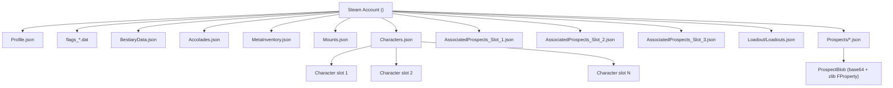
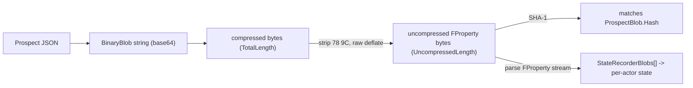
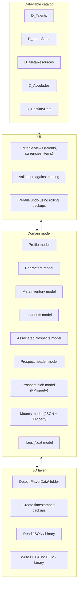

# Icarus Save System: Complete Field Guide for a Save Editor

> **Audience.** This document is written for future agents and developers who want to build a save editor / save-corruption recovery tool for Icarus (RocketWerkz, UE4). It is based on a live analysis of an actual `PlayerData\<SteamID>\` directory on Windows as of the **Mendel update (Week 220, Feb 2026)**, plus a successful in-place modification of `Characters.json` that the game accepted on next load.
>
> Everything below was empirically confirmed by reading the user's own save files. Where a behaviour was inferred rather than observed, it is marked **(inferred)**.

---

## 1. Where the saves live

All player saves live under:

```text
%LOCALAPPDATA%\Icarus\Saved\
```

i.e. on Windows that resolves to `C:\Users\<user>\AppData\Local\Icarus\Saved\`. Top-level subfolders:

| Folder | Purpose | Editor relevance |
| --- | --- | --- |
| `Config\` | Per-user `*.ini` (controls, graphics) | Out of scope for save recovery. |
| `Crashes\` | Crash dumps | Out of scope. |
| `ExtraData\` | Misc engine cache | Out of scope. |
| `Logs\` | UE log files | Useful for diagnosing rejected saves. |
| `PlayerData\<SteamID>\` | **Everything we care about.** | Primary target. |
| `SaveGames\` | `SpectatorSettings.sav` plus `steam_autocloud.vdf` | Mostly UI settings. |
| `Screenshots\` | Screenshots | Out of scope. |

The interesting Steam-ID-keyed directory looks like this (active files only; backups omitted — see §10):

```text
PlayerData\<SteamID>\
├── Profile.json                       <-- player-level meta (currencies, workshop, flags)
├── Characters.json                    <-- the 1..N characters on the account
├── MetaInventory.json                 <-- the orbital workshop "stash" inventory
├── Mounts.json                        <-- tamed mounts (engine binary blobs)
├── BestiaryData.json                  <-- bestiary scan progress
├── Accolades.json                     <-- achievement log w/ timestamps
├── Loadout\Loadouts.json              <-- per-prospect loadouts (envirosuit + meta items)
├── AssociatedProspects_Slot_1.json    <-- prospects claimed by char in slot 1
├── AssociatedProspects_Slot_2.json    <-- ... slot 2
├── AssociatedProspects_Slot_3.json    <-- ... slot 3
├── Prospects\<ProspectName>.json      <-- the actual world saves (compressed blobs)
├── MapData\Terrain_XXX.fog            <-- fog-of-war per zone (binary)
├── Mounts\<icon>.exr                  <-- mount portrait textures
├── flags_<SteamID>.dat                <-- binary unlock flags
└── steam_autocloud.vdf                <-- Steam Cloud manifest
```

Every JSON file in `PlayerData\` is **UTF-8 without BOM**, with tab indentation and CRLF line endings as written by the game. PowerShell's `ConvertTo-Json` flips those to spaces/LF, but the game's JSON parser is tolerant of either; the only side effect is that the file's byte-level formatting changes after a tool round-trip.

---

## 2. High-level data model



Conceptually:

- **Profile.json** holds anything that is *account-wide* and survives character deletion: currencies (credits, exotics, biomass), unlocked workshop blueprints, story/tutorial flags, and the counter for the next character slot.
- **Characters.json** holds the *roster* — name, gender, cosmetics, talents, XP, location, who is dead/abandoned — but **no inventory and no current-world state**. Per-character world state lives in the prospect file.
- **MetaInventory.json** is the orbital workshop / stash inventory: items you crafted "above the planet" and bring down on a drop.
- **Loadout/Loadouts.json** holds, for every prospect you've claimed, the **drop-in loadout** (envirosuit + dropship parts + meta items that ride down with you) keyed by `ChrSlot` + `Guid` + `ProspectID`.
- **Prospects\<name>.json** is the actual *world save*: it contains a small JSON `ProspectInfo` header plus a single huge zlib-compressed binary `ProspectBlob` that decompresses to UE's FProperty actor-recorder dump (creatures, structures, item drops, terrain modifications, …). See §8.
- **AssociatedProspects_Slot_N.json** is the per-character index: "this character has been to these prospects, hosted on this Steam P2P server".
- **Mounts.json** and **Accolades.json** and **BestiaryData.json** are account-wide trackers, all JSON.
- **flags_<SteamID>.dat** is a tiny binary mirror of certain UnlockedFlags (see §9).
- **MapData\\*.fog** stores fog-of-war per terrain ID as opaque bytes (binary, not safe to edit without decompiling the game; out of scope here).

---

## 3. Profile.json — currencies, workshop unlocks, account flags

A complete example (truncated talent list):

```json
{
    "UserID": "00000000000000000",
    "MetaResources": [
        { "MetaRow": "Refund",         "Count": 31  },
        { "MetaRow": "Credits",        "Count": 5840 },
        { "MetaRow": "Exotic1",        "Count": 37  },
        { "MetaRow": "Exotic_Red",     "Count": 959 },
        { "MetaRow": "Biomass",        "Count": 5   },
        { "MetaRow": "Licence",        "Count": 0   },
        { "MetaRow": "Exotic_Uranium", "Count": 25  }
    ],
    "UnlockedFlags": [ 5, 26, 1, 63, 60, 66, 67, 7, 24, 45, 86, 93 ],
    "Talents": [
        { "RowName": "Prospect_OLY_Forest_Recon", "Rank": 1 },
        { "RowName": "Workshop_Envirosuit",       "Rank": 1 }
        // ... ~270 rows in this observed save ...
    ],
    "NextChrSlot": 4,
    "DataVersion": 4
}
```

*(Illustrative — values come from a real Mendel-era save snapshot. Counts and flag IDs vary between saves; treat this block as a shape reference, not canonical values.)*

### 3.1 Top-level fields

| Field | Type | Meaning | Editor notes |
| --- | --- | --- | --- |
| `UserID` | string | Steam ID (must equal the parent folder name) | Don't touch. The game will reject a profile whose UserID doesn't match the folder. |
| `MetaResources` | array of `{MetaRow, Count}` | Account-wide currencies. | See §3.2. Adding/removing rows is safe; the game tolerates unknown rows and defaults missing rows to 0. |
| `UnlockedFlags` | array of small ints | Account-level unlock bits (DLC, mission-chain progress, tutorial gates). | See §9. Strictly additive — set, don't remove unless you know what each ID does. |
| `Talents` | array of `{RowName, Rank}` | **Workshop / blueprint unlocks** keyed by `D_Talents` `RowName`. *Not the same table as character talents.* All ranks observed = 1 (these are binary "you have the blueprint" toggles). | Adding any `RowName` here makes that workshop recipe craftable. Removing one re-locks it. |
| `NextChrSlot` | int | Slot index assigned to the **next** character you create. | Auto-incremented when a character is created. Don't decrement below `max(ChrSlot)+1`. |
| `DataVersion` | int | Schema version. As of the Mendel update this is `4`. | The game uses this to run migration code on load. Always preserve whatever value the game last wrote. |

### 3.2 MetaResources (currencies & exotics)

These are the only known `MetaRow` keys, all observed in a live profile:

| `MetaRow` | In-game name | Notes |
| --- | --- | --- |
| `Credits` | **Ren credits** (the main soft currency). Used to buy prospects/loadouts. | int, unbounded. |
| `Refund` | **Refund tokens** awarded when you respec talents. | int, unbounded. |
| `Exotic1` | **Exotic** (white/standard exotics). | int. The game truncates to its own cap when over. |
| `Exotic_Red` | **Red Exotics** (Styx-tier). | int. |
| `Exotic_Uranium` | **Uranium Exotics**. | int, observed on the live Mendel save. |
| `Biomass` | **Biomass** (Mendel-era husbandry currency). | int, new in Mendel. |
| `Licence` | **Faction Licence** / mission token. | int, used to unlock faction missions. |

**Editor rule:** Whenever you add an entry, use exactly one record per `MetaRow`; the game's loader is a `Map<RowName,int>` and duplicates silently overwrite. The schema is open — future updates *will* add new rows (e.g. a "Yellow Exotic"), so a save editor should round-trip unknown rows verbatim, not whitelist them.

### 3.3 Profile-level Talents are *workshop blueprints*

Profile.json's `Talents` array is unrelated to character skill trees (those live in `Characters.json`, §4). It is the **catalog of blueprints/recipes the account has unlocked** in the orbital workshop. Naming conventions seen in a real save:

- `Workshop_Envirosuit*`, `Workshop_Carbon_*` — envirosuit & armour variants
- `Workshop_Axe_*`, `Workshop_Pickaxe_*`, `Workshop_Knife_*`, `Workshop_Spear_*`, `Workshop_Bow_*`, `Workshop_Arrow_*`, `Workshop_Crossbow_*`, `Workshop_Hammer_*`, `Workshop_Sickle_*`, `Workshop_Shovel`, `Workshop_CHAC_*` — tools and weapons
- `Workshop_Module_*` — backpack/envirosuit module slots and feature unlocks
- `Workshop_Seed_*` — crop seeds
- `Workshop_Resource_Pack_*` — pre-packed orbital resource drops
- `Workshop_Creature_*` — tameable creature blueprints (incl. `Workshop_Creature_Dog_*`, `Workshop_Creature_Horse_*`, etc.)
- `Workshop_Meta_*` — orbital meta-tools (radar, extractor, power source, scanner)
- `Workshop_Bandage_*`, `Workshop_Antibiotic_*`, `Workshop_Antiparasitic_*`, `Workshop_Blood_Thinning_*`, `Workshop_Antipoison_*`, `Workshop_Dressing_Kit`, `Workshop_Splint_Kit` — medical
- `Workshop_Larkwell_*`, `Workshop_Inaris_*`, `Workshop_Shengong_*` — corp-specific tiers
- `Prospect_OLY_*`, `Prospect_Pro_*` — prospect-completion flags (per biome / per chapter)

To "max out workshop", the safe additive strategy is to **enumerate every `RowName` in `D_Talents` whose key starts with `Workshop_` or `Prospect_` and add it at Rank 1**. The canonical source is `D_Talents` from the game's data tables; see §11.

---

## 4. Characters.json — the character roster

The container shape is unusual: an *outer* JSON object whose single key is the literal string `"Characters.json"`, whose value is an **array of JSON-stringified blobs**. Each blob, parsed, yields one character record.

```json
{
    "Characters.json": [
        "{\n\t\"CharacterName\": \"PANICK\", ... }",
        "{\n\t\"CharacterName\": \"IM PANICKING\", ... }",
        "{\n\t\"CharacterName\": \"Im Lost\", ... }"
    ]
}
```

A save editor must therefore:
1. `ConvertFrom-Json` the outer file.
2. Iterate the inner array and `ConvertFrom-Json` each string element.
3. Modify the parsed objects.
4. Re-stringify each inner record (`ConvertTo-Json -Depth 20`) **then** re-stringify the outer wrapper.
5. Write UTF-8 without BOM.

### 4.1 Character record fields

Observed top-level keys on each character:

| Field | Type | Notes |
| --- | --- | --- |
| `CharacterName` | string | Display name. |
| `ChrSlot` | int (1-N) | Stable slot identity. Must be unique within the file and must be ≤ `Profile.NextChrSlot - 1`. |
| `XP` | int64 | Total accumulated experience. Level is derived by the game from a curve; setting XP to ≥ 80,000,000 is enough to leave the level cap at the time of writing (the user's max characters sat at ~57M and ~61M, and the cap is 60). |
| `XP_Debt` | int64 | XP penalty pool the game subtracts before crediting any new XP. **Set to 0** to fully clear debt. |
| `Talents` | array of `{RowName, Rank}` | Skill trees the character has spent points in. Keys reference `D_Talents` rows whose `Tree` is one of the player trees (Hunting, Resources, Cooking, Crafting, Combat, Exploration, Husbandry, Construction, **Genetics**, …). See §4.2. |
| `IsDead` | bool | Permadeath flag. Set to `false` to revive an abandoned character; the game will respawn them at next prospect entry. |
| `IsAbandoned` | bool | Was abandoned in a prospect (insurance-loss state). |
| `LastProspectId` | string | The prospect this character was last in. Used for the "claimed character is in another prospect" UI. |
| `Location` | string | Last terrain key, e.g. `Outpost006_Olympus`. |
| `UnlockedFlags` | array of small ints | Character-level flag bits (separate from the account-level flags in Profile.json). |
| `MetaResources` | array of `{MetaRow, Count}` | Per-character carry-over currencies (rarely populated; often empty). |
| `Cosmetic` | object | Appearance — **all integer indices** into in-game cosmetic tables (no colour strings). See §4.3. |
| `TimeLastPlayed` | int64 | Unix epoch seconds this character was last played. Read-only display; preserve verbatim. |

### 4.2 Character talents

These are the **gameplay** skill trees. The full union across this account is **1,067 unique `RowName`s** after the Mendel update (per-save union — not necessarily the full `D_Talents` player-tree row count).

**Important:** the `RowName` *prefix* is **not** the in-game skill tree name in general — it is the *recipe / item / mechanic family* the talent belongs to. The in-game **Tree** grouping (Hunting, Resources, Construction, …) is a separate field stored in `D_Talents`, and a save editor should fetch it from the catalog rather than infer it from the prefix.

Top observed prefixes on the live save (counts are total `RowName` instances across all 3 characters — divide by character count for unique-per-character):

| Prefix | Count | What it is |
| --- | --- | --- |
| `Wood_*`, `Iron_*`, `Stone_*`, `Concrete_*`, `Obsidian_*`, `Titanium_*`, `Steel_*` | ~30–96 each | Material / refining recipes |
| `Bow_*`, `Knife_*`, `Spear_*`, `Crossbow_*`, `Hammer_*`, `Pistol_*`, `Rifle_*`, `Shotgun_*`, `Firearm_*` | ~12–63 each | Weapon recipes |
| `Solo_*`, `Exploration_*` | 81 each | Mechanic perks |
| `Resources_*`, `Advanced_*` | 72 each | Resource extraction / advanced crafting |
| `Building_*`, `Tools_*` | 66 each | Building / tool recipes |
| `Husbandry_*`, `Fishing_*` | 57 each | Animal husbandry / fishing |
| `Genetics_*` | 48 (16 unique × 3 chars) | **Mendel Genetics tree — see §4.2.1** |
| `Hunting_*`, `Combat_*`, `Cooking_*`, `Crafting_*` | ~3–15 each | Top-level tree-named perks (small handful) |

The full prefix histogram (200+ distinct prefixes, mostly recipe families) is reproducible with PowerShell:

```powershell
$path = "$env:LOCALAPPDATA\Icarus\Saved\PlayerData\<SteamID>\Characters.json"
$outer = Get-Content $path -Raw | ConvertFrom-Json
$chars = $outer.'Characters.json' | ForEach-Object { $_ | ConvertFrom-Json }
$chars.Talents.RowName | ForEach-Object { ($_ -split '_')[0] } |
  Group-Object | Sort-Object Count -Descending | Select-Object Count,Name
```

**Take-away for a save editor:** treat `RowName` as an opaque catalog key; resolve display name + tree grouping + true max-rank from `D_Talents`. Do not infer tree membership from the prefix alone (only `Genetics_*` happens to match its tree name 1:1).

**Editing rules:**
- Each unique `RowName` may appear **once** per character. The game does not handle duplicates gracefully (last-write-wins, but you may corrupt UI badges).
- `Rank` starts at 1; max rank is row-specific. Empirically, **Rank 4 is the highest observed** across the whole talent table; if you blindly set every talent to Rank 4 and the row's true max is lower, the game silently clamps it back on next load (confirmed: the user's "max everything" edit was accepted, and the game clamped over-ranked rows during the post-load validation pass). **Caveat:** this clamp behaviour rests on a **single observation** (one save, one game build); re-verify it on each `DataVersion` bump before relying on "blind Rank 4" as a safe strategy.
- Rows whose names end in `_Reroute*` are visual path nodes with no rewards/icons; skip them. (`Genetics_Mutation_Reroute`, `Genetics_Reroute2`, `Genetics_Reroute3` were verified empty.)
- It is safe to *add* a talent the character never picked. It is **not** safe to remove a talent whose effect has already been baked into a structure on the world map (e.g. some building-blueprint talents enable in-prospect crafters; removing them mid-prospect can orphan recipes).

#### 4.2.1 Genetics tree (Mendel update)

The Mendel update added a tree displayed in-game as **"Genetics"**, with all RowNames using the `Genetics_*` prefix. Earlier IUUT docs referred to this as `Construction_Genetics` — that string does **not** appear in any save file we have observed and should be treated as an outdated/incorrect name; the canonical phrasing is just **"Genetics" tree, prefix `Genetics_`**.

The 16 functional Genetics `RowName`s (all 16 confirmed present on the live save):

```text
Genetics_GestationSpeed
Genetics_GestationBuff
Genetics_RecoverySpeed
Genetics_GenotypeMutation
Genetics_GenotypeMutation2
Genetics_PhenotypeMutation
Genetics_PhenotypeMutation2
Genetics_WildGenome
Genetics_WildPhenome
Genetics_WildBloodline
Genetics_SireBuff
Genetics_MaternalBuff
Genetics_Twins
Genetics_Lineage
Genetics_Experience
Genetics_Reduced_Threat
```

### 4.3 Cosmetic block

Exact shape observed on every character (verified against the live save, all
3 characters). **Every value is an integer index** into an in-game cosmetic
table, except `IsMale` (bool):

```json
"Cosmetic": {
    "Customization_Head": 12,
    "Customization_Hair": 7,
    "Customization_HairColor": 3,
    "Customization_Body": 4,
    "Customization_BodyColor": 1,
    "Customization_SkinTone": 2,
    "Customization_HeadTattoo": 0,
    "Customization_HeadScar": 0,
    "Customization_HeadFacialHair": 0,
    "Customization_CapLogo": 0,
    "IsMale": true,
    "Customization_Voice": 3,
    "Customization_EyeColor": 5
}
```

| Key | Type | Meaning |
| --- | --- | --- |
| `IsMale` | bool | Body/voice base. |
| `Customization_Head` | int | Head/face mesh index. |
| `Customization_Hair` | int | Hair style index. |
| `Customization_HairColor` | int | Hair colour **palette index** (not a hex string). |
| `Customization_Body` | int | Body type index. |
| `Customization_BodyColor` | int | Body/clothing colour palette index. |
| `Customization_SkinTone` | int | Skin tone palette index. |
| `Customization_HeadTattoo` | int | Face tattoo index (0 = none). |
| `Customization_HeadScar` | int | Face scar index (0 = none). |
| `Customization_HeadFacialHair` | int | Facial-hair index (0 = none). |
| `Customization_CapLogo` | int | Cap/helmet logo index. |
| `Customization_Voice` | int | Voice index. |
| `Customization_EyeColor` | int | Eye colour palette index. |

> **Correction (2026-05-30, verified against the full live save).** Earlier
> drafts of this guide listed `Customization_HeadColors` / `Customization_BodyColors`
> as **hex/RGBA colour strings**, plus `Customization_HeadPaint` / `BodyPaint`,
> `Customization_Scar`, `Customization_FacialHair`, and `Customization_VoiceID`.
> **None of those field names exist** in observed saves, and **there are no colour
> strings** — every colour is an integer palette index (`Customization_HairColor`,
> `Customization_BodyColor`, `Customization_EyeColor`). The real keys are the 13
> above. There is no "out-of-range hex" assertion risk because there is no hex.

IUUT shows these read-only (cosmetics are editable natively in-game).

---

## 5. MetaInventory.json — the orbital stash

A flat list of items in the orbital workshop inventory. Top-level shape:

```json
{
    "InventoryID": "MetaInventoryID_Main",
    "Items": [ /* item records */ ]
}
```

### 5.1 Item record schema

```json
{
    "ItemStaticData": {
        "RowName": "Envirosuit_Tier2",
        "DataTableName": "D_ItemsStatic"
    },
    "ItemDynamicData": [
        { "PropertyType": "ItemableStack", "Value": 1 },
        { "PropertyType": "Durability",    "Value": 5500 }
    ],
    "ItemCustomStats": [],
    "CustomProperties": {
        "StaticWorldStats": [],
        "StaticWorldHeldStats": [],
        "Stats": [],
        "Alterations": [],
        "LivingItemSlots": []
    },
    "DatabaseGUID": "F44CB30140004789820E20B75577DEA1",
    "ItemOwnerLookupId": -1,
    "RuntimeTags": { "GameplayTags": [] }
}
```

| Field | Notes |
| --- | --- |
| `ItemStaticData.RowName` | The item identifier; must be a key of `D_ItemsStatic`. Examples observed: `Envirosuit_Tier2`, `Envirosuit_Shengong`, `Envirosuit_Inaris_Alpha`, `Envirosuit_Larkwell_Alpha/Bravo`, `Hunters_Backpack`, `Basic_Quiver`, `Meta_Carbon_Head_Beta`, `Meta_Carbon_Arms_Beta`, `Meta_Pickaxe_Shengong_Echo`, `Meta_Crossbow_Inaris_D`, `Meta_Module_*`, `Meta_Bow_Shengong_Echo`, `Meta_Bolt_Set_Larkwell_Piercing`, `Meta_Arrow_Set_Larkwell_Ballistic/Bleed`, etc. |
| `ItemDynamicData[]` | Stack size, durability, mag size, ammo type, building variation, … all observed `PropertyType` values: `ItemableStack`, `Durability`, `AssociatedItemInventoryId`, `AssociatedItemInventorySlot`, `BuildingVariation`, `CurrentAmmoType`, `DynamicState`, `GunCurrentMagSize`, `InventoryContainer_LinkedInventoryId`. |
| `DatabaseGUID` | Unique per-item GUID. **Must be unique within the file.** When adding a new item, generate a fresh 32-hex GUID. |
| `ItemOwnerLookupId` | -1 = no owner (in the stash). Non-negative values point into a runtime lookup table; leave as -1 when adding stash items. |
| `RuntimeTags.GameplayTags` | UE gameplay tag strings. Almost always empty in the stash. |
| `CustomProperties.*` | Living-item state (taming, growth, etc.) for animals or seeds. Empty for inert items. |

**Editor rules:**
- To **add an item to the stash**, append a new record with a fresh `DatabaseGUID` and `ItemOwnerLookupId: -1`.
- To **change durability**, edit the `Durability` value inside `ItemDynamicData`. The game's "broken" threshold is at 0; values above the item's `MaxDurability` (from `D_ItemsStatic`) are clamped on next pick-up.
- To **change stack size**, edit `ItemableStack`. Stacks above the row's max are clamped.
- Removing an item is safe iff no `Loadout` references its `DatabaseGUID` (see §6).

---

## 6. Loadout\Loadouts.json — per-prospect loadouts

`Loadouts.json` is an outer object `{ "Loadouts": [ ... ] }`. Each entry binds a **character slot** to a **specific prospect** with a **specific envirosuit + dropship + meta-items**.

```json
{
    "EnviroSuit": { /* same shape as MetaInventory item */ },
    "Dropship":   { "Name": "", "Type": "DropshipType_UndefinedID", "DropshipID": 0,
                    "InUse": false, "TOP_Part": {...}, "MID_Part": {...}, "BTM_Part": {...} },
    "MetaItems":  [ /* array of MetaInventory-style items */ ],
    "AssociatedProspect": { /* AssociatedProspect record - see §7 */ },
    "HostedBy": { "LastHostType": "SteamP2P|LocalHost|DedicatedServer",
                  "SteamP2PHostId": "...", "DedicatedServerIP": "...",
                  "CachedServerName": "..." },
    "bInsured": false,
    "bSettled": false,
    "LoadoutClaimTime": 1689470045,
    "ChrSlot": 1,
    "Guid": "95CDD50C44BC5076E1FFADB2D00FBEB3"
}
```

Notes:
- `EnviroSuit.DatabaseGUID` and each `MetaItems[].DatabaseGUID` are **the same GUIDs that appear in `MetaInventory.json`** while the loadout is unclaimed; when the player drops, those items are moved out of MetaInventory and into the prospect, and the loadout entry retains the GUIDs as a back-reference for unclaim/insurance.
- `LoadoutClaimTime` is a Unix epoch second.
- `Guid` (loadout-level) is independent of the item GUIDs and identifies the *loadout slot* itself.
- `ChrSlot` must match an existing `Characters.json` character.
- Removing a loadout entry while the character is mid-prospect can softlock the character's return. Always check `AssociatedProspect.ProspectState == "Active"` before touching it.

---

## 7. AssociatedProspects_Slot_N.json

Same nested-stringified-array pattern as Characters.json. One file per character slot N (1, 2, 3, …). Each inner blob is:

```json
{
    "AssociatedProspect": {
        "ProspectID":             "<unique world id>",
        "ClaimedAccountID":       "<hosting Steam ID>",
        "ClaimedAccountCharacter": <int slot of host's character>,
        "ProspectDTKey":          "Outpost006_Olympus",
        "FactionMissionDTKey":    "",
        "LobbyName":              "",
        "ExpireTime":             -1,
        "ProspectState":          "Active",
        "AssociatedMembers": [
            {
                "AccountName":         "<Steam name>",
                "CharacterName":       "<character name>",
                "UserID":              "<Steam ID>",
                "ChrSlot":             <int>,
                "Experience":          <int>,
                "Status":              "Prospect_Conifer",
                "Settled":             false,
                "IsCurrentlyPlaying":  false
            }
        ],
        "Cost":               0,
        "Reward":             0,
        "Difficulty":         "Easy|Medium|Hard|Extreme",
        "Insurance":          false,
        "NoRespawns":         false,
        "ElapsedTime":        0,
        "SelectedDropPoint":  0,
        "CustomSettings":     []
    },
    "HostedBy": {
        "LastHostType":      "LocalHost|SteamP2P|DedicatedServer",
        "SteamP2PHostId":    "<host Steam ID>",
        "DedicatedServerIP": "<ip:port>",
        "CachedServerName":  ""
    }
}
```

This file is essentially **a per-character index of prospects to show in the "Continue" UI**. Editing it is rarely needed except to recover from "character is stuck in a prospect" softlocks — clear the entry whose `ProspectID` matches the broken world, and the character becomes claimable again.

---

## 8. Prospects\<Name>.json — the world saves

Each prospect lives in its own file. The **filename is an arbitrary string** — the player chooses it when claiming the prospect (sometimes auto-generated by the game as a GUID for special / host-shared prospects). Filenames are not constrained to any `Outpost*` / `Pro_*` pattern. Live examples from one save:

```text
Olympus.json
PGH-5.json
Kiara&Joseph.json
RedExoticFarming.json
5A8854EE4B2F1206479B6EB900BEC08B.json    ← GUID-named (host-shared)
```

Do not key any logic on the filename string. The stable identifiers are inside the JSON: `ProspectInfo.ProspectID` (display ID, e.g. `Olympus`), `ProspectDTKey` (data-table reference, e.g. `Outpost006_Olympus`), and the recovery walker should glob `Prospects\*.json` rather than match a pattern.

Sizes range from ~20 KB (a fresh outpost) to **~870 KB compressed / ~3 MB uncompressed** (a heavily-built late-game world).

Shape:

```json
{
    "ProspectInfo": {
        "ProspectID":              "Olympus",
        "ClaimedAccountID":        "<Steam ID>",
        "ClaimedAccountCharacter": 2,
        "ProspectDTKey":           "Outpost006_Olympus",
        "FactionMissionDTKey":     "",
        "LobbyName":               "",
        "ExpireTime":              -1,
        "ProspectState":           "Active|Completed|Failed",
        "AssociatedMembers":       [ /* same shape as in AssociatedProspects */ ],
        "Cost":                    0,
        "Reward":                  0,
        "Difficulty":              "Medium",
        "Insurance":               false,
        "NoRespawns":              false,
        "ElapsedTime":             155,
        "SelectedDropPoint":       12,
        "CustomSettings":          []
    },
    "ProspectBlob": {
        "Key":                "actors",
        "Hash":               "<sha1 hex of UNCOMPRESSED bytes>",
        "TotalLength":        60870,
        "DataLength":         60870,
        "UncompressedLength": 2769682,
        "BinaryBlob":         "eJzs3Ql4E9XaB/..."
    }
}
```

### 8.1 How `ProspectBlob.BinaryBlob` is encoded

Empirically verified on `Prospects\Olympus.json`:

1. The string is **standard base64** (no URL-safe variant).
2. `Convert.FromBase64String(BinaryBlob)` yields `TotalLength` bytes (60,870 in this case).
3. Those bytes start with `78 9C ...`, the standard **zlib** header (default compression).
4. Skip the first 2 zlib header bytes and feed the rest into a raw deflate stream (`System.IO.Compression.DeflateStream`) to get `UncompressedLength` bytes (2,769,682 here).
5. The first bytes of the decompressed buffer (`StateRecorderBlobs`, `ArrayProperty`, `StructProperty`, `ComponentClassName`, `/Script/Icarus.EnzymeGeyserRecorderComponent`, `BinaryData`, …) confirm this is a standard **Unreal Engine FProperty serialization**, specifically a tree of `StateRecorderBlob` structs — the same recorder pattern used inside `Mounts.json` (§9.2), but for every actor in the world.
6. `Hash` is the **SHA-1 of the uncompressed bytes**, used by the game on load to detect tampering / partial writes. If you edit a blob you **must** recompute SHA-1 (uppercase or lowercase hex both accepted by every parser observed) and update `Hash`, `UncompressedLength`, and the compressed `TotalLength`/`DataLength`.

#### Recompression (writing a valid blob)

Decompression is "strip 2 bytes, raw-deflate"; **recompression is not symmetric** — a strict zlib decoder rejects a stream missing its trailer. To rebuild a valid `BinaryBlob` you must reconstruct the full zlib wrapper:

1. **Raw-deflate** the (possibly mutated) uncompressed bytes (`System.IO.Compression.DeflateStream` in `CompressionMode.Compress`).
2. **Prepend** the 2-byte zlib header `78 9C` (default-compression, no preset dictionary).
3. **Append** a 4-byte **big-endian Adler-32** checksum computed over the **uncompressed** bytes (NOT the deflated bytes). Adler-32 is part of the zlib spec; a missing or wrong trailer is the most common cause of "blob decompresses in some tools, game rejects it on load."
4. Base64-encode the resulting `[78 9C] + deflate(payload) + [adler32_BE(payload)]`.
5. Recompute and update `Hash` (SHA-1 of uncompressed), `UncompressedLength`, `TotalLength`, `DataLength`.

**Implementation note:** Prefer .NET's `System.IO.Compression.ZLibStream` (available in .NET 6+), which handles the full zlib wrapper (header + deflate + Adler-32 trailer) in a single stream. Hand-rolling steps 1–3 with `DeflateStream` is error-prone — the Adler-32 trailer is the most-missed piece.

> **Empirically re-verified (2026-05-30)** on a live prospect (`Womperton the Fourth.json`):
> the `BinaryBlob` base64-decodes to exactly `TotalLength` bytes starting `78 9C`;
> raw-inflating (skipping the 2 header bytes) yields exactly `UncompressedLength` bytes
> beginning `…StateRecorderBlobs…ArrayProperty…`; `SHA-1(uncompressed)` equals
> `ProspectBlob.Hash`; and the final 4 bytes equal the **big-endian Adler-32** of the
> uncompressed payload. The codec above is correct end-to-end.



### 8.2 What's *inside* the FProperty stream

Per-actor records keyed by `ComponentClassName` strings of the form `/Script/Icarus.<X>RecorderComponent`. Examples present in the user's saves:

- `EnzymeGeyserRecorderComponent` — enzyme geyser state
- `IcarusMountCharacterRecorderComponent` — mount stats, talents, inventory (also embedded in `Mounts.json`)
- Plus the standard menagerie of building, item-drop, dead-body, animal-AI, weather, mission-trigger recorders that any UE save game has.

Each per-actor record contains its own little tree of UE FProperty-encoded fields: `TArray<FProperty>`, `FString`s with leading int32 lengths and null terminators, `FName`s with int32 length + null, integer/bool/float primitives, `EnumProperty` values stored as full enum-name strings, embedded `StructProperty` blobs, etc.

For a **save editor**, three useful levels of access:

1. **Header-only edits.** Modify `ProspectInfo` and call it a day. Safe to flip `ProspectState`, change `Difficulty`, set `Insurance: true`, edit `AssociatedMembers`, etc. — the JSON parser is independent of the blob. This is by far the safest level of modification.
2. **Reconstruct on round-trip.** Decompress -> mutate the uncompressed bytes -> recompress with zlib default -> recompute SHA-1 -> base64. This works because the engine treats the blob as opaque on load apart from the SHA-1 check.
3. **Full FProperty parser.** Required to do useful things like "give every storage chest 10 stacks of iron". This means writing (or borrowing) an Unreal `.sav` parser. See [crumplecorn/ue4-save-editors](https://github.com/crumplecorn/ue4-save-editors) and similar references for the FProperty grammar — it is **not** Icarus-specific.

### 8.3 Backups

Every prospect has rolling backups: `Prospects\<Name>.json.backup`, `.backup_1`, … `.backup_10`. The most recent is `.backup`, oldest is `.backup_10`. The game rotates them on each clean shutdown. **For corruption recovery, prefer `.backup_1` over `.backup`** — the freshest backup is sometimes the one that was just written from the corrupted in-memory state. `.backup_1` is the previous good shutdown.

---

## 9. Engine-binary files

These files are *not* JSON and require either a binary parser or careful byte surgery.

### 9.1 `flags_<SteamID>.dat`

82 bytes in the observed save. Layout:

```text
offset  size  field
0       4     u32      length prefix = 18 (17 chars + NUL)
4       17   ASCII     SteamID, e.g. "00000000000000000"
21      1     u8       NUL terminator (0x00)
22      4     u32      flag count N
26      N*4  u32[]     unlocked flag IDs (little-endian)
```

The length prefix follows standard UE `FString` semantics and **includes the trailing null terminator** (a SteamID64 is 17 ASCII chars, so 17 + 1 NUL = 18 = 0x12). Total bytes for the observed file: 4 + 17 + 1 + 4 + 14*4 = **82**.

In the user's profile the flag list was `[1, 2, 3, 4, 5, 18, 19, 21, 22, 23, 24, 25, 26, 27]` (14 entries). **This is a different namespace from `Profile.json.UnlockedFlags`** — `flags_*.dat` looks like a hardcoded engine-side "feature unlock" set (DLC / sandbox-mode / tutorial-completed style toggles), while `Profile.UnlockedFlags` is the narrative/account flag set used by the metaprogression UI.

**Editor recipe:** to add flag `N`, increment the u32 count and append `pack("<I", N)`. To zero it out (full "fresh account" reset), write the header + count `0`. The file is short enough to hand-build.

### 9.2 `Mounts.json` — JSON outer, binary inner

JSON wrapper:

```json
{
    "SavedMounts": [
        {
            "DatabaseGUID": "noguid",
            "RecorderBlob": {
                "ComponentClassName": "/Script/Icarus.IcarusMountCharacterRecorderComponent",
                "BinaryData":         [ 16, 0, 0, 0, 83, 116, 111, 109, 97, 99, 104, ... ]
            },
            "MountName":     "Snowflake",
            "MountLevel":    9,
            "MountType":     "Arctic_Moa",
            "MountIconName": "775635"
        }
    ]
}
```

The four JSON-level fields at the bottom (`MountName`, `MountLevel`, `MountType`, `MountIconName`) are **denormalised copies for the UI** of values that also live inside `BinaryData` — the game's slot picker reads the JSON for speed and only deserialises the binary on dispatch. **Editing the JSON copies alone is enough** for cosmetic UI fixes (rename your moa), but the binary is what the world actually loads when the mount is summoned.

`BinaryData` is a flat int array where each element is a single byte (0..255). To turn it into FProperty bytes:

```python
buf = bytes(BinaryData)
```

Then the buffer is a standard UE FProperty stream of the same shape as the prospect blob but **not zlib-compressed**. Looking at the bytes literally:

```text
10 00 00 00 'S t o m a c h C o n t e n t s' 00
0E 00 00 00 'A r r a y P r o p e r t y'    00
...
```

every record is `int32 nameLen | ASCII name | 0x00 | int32 typeLen | ASCII type | 0x00 | int64 payloadLen | payload | ...` — the textbook UE serializer.

Fields a save editor will care about, all directly visible in the ASCII layer of the buffer for `Snowflake`:
- `MountName` (string)
- `MountLevel` / `Experience` (`int32`)
- `OwnerCharacterID` -> `PlayerCharacterID` -> `PlayerID` (string Steam ID), `ChrSlot` (int)
- `OwnerName` (string)
- `Talents` (array of `MountTalentSaveData { TalentRowName: string, TalentRank: int }`)
- `FoodLevel`, `WaterLevel`, `OxygenLevel`, `Stamina`, `CurrentHealth` (int)
- `AISetupRowName` (FName), e.g. `Mount_Arctic_Moa`, `Tame_Dog_B1`, `Mount_Moa`, `Mount_Tusker`
- `ActorTransform` (FTransform: quat rotation, vector translation, vector scale)
- A `CosmeticSkinIndex` and `LastLevelAchieved`

To, for example, max a mount's level without breaking the binary: bump `Experience` to a large positive int32 (the four bytes after the `Experience\0IntProperty\0\x04\0\0\0\0\0\0\0\0` header), then edit the duplicate `MountLevel` JSON field to match. Better, of course, is to use a UE FProperty parser; doing it by hand requires great care because the parent payload-length fields (`payloadLen`) must be updated if you grow/shrink any string.

### 9.3 `MapData\Terrain_XXX.fog`

Opaque per-zone fog-of-war bitmap. Tiny (0.4-16 KB). Out of scope; delete to reset fog for that zone.

### 9.4 `Mounts\<id>.exr`

OpenEXR images used as portraits for tamed mounts. The numeric id maps to `MountIconName` in `Mounts.json`.

---

## 10. Backups, atomicity, and editing safely

Backup rotation is **per-file** and **not universal**. Empirically observed on the live save (2026-05-24):

| File | Backup files present | Naming |
| --- | --- | --- |
| `Profile.json` | `.backup` + `.backup_1` … `.backup_10` (11 total) | `.backup` / `.backup_<N>` |
| `Characters.json` | 11 total | same |
| `Accolades.json` | 11 total | same |
| `BestiaryData.json` | 11 total | same |
| `Mounts.json` | 11 total | same |
| `Prospects\<X>.json` | up to 11 per prospect (some have fewer) | same |
| `Loadout\Loadouts.json` | **1** — only `Loadouts.json.4.backup` exists | `.<N>.backup` (different convention!) |
| `MetaInventory.json` | **0** — no backups | — |
| `AssociatedProspects_Slot_*.json` | **0** — no backups | — |
| `flags_<SteamID>.dat`, `steam_autocloud.vdf`, `MapData\*.fog`, `Mounts\*.exr` | 0 | — |

**Two consequences for a recovery flow:**

1. **Some files have no game-managed backups at all.** For `MetaInventory.json` and `AssociatedProspects_Slot_*.json` the recovery flow has no rolling-backup fallback — it must either restore from the editor's own `.iuut-backup-*` copies, or fall back to template repair. This is also why IUUT must take its own backup before any write to these files even though no rotation exists.
2. **The Loadouts naming convention differs** (`.<N>.backup` not `.backup_<N>`), which is why recovery walks must glob `<File>.*backup*` rather than iterate a fixed name list (see master doc §12.1).

**Editor protocol:**

1. **Refuse to run while Icarus is open.** The game holds open handles for some files and overwrites them on clean shutdown — your edit will be silently reverted.
2. **Create your own timestamped backup** alongside the file (e.g. `Profile.json.iuut-backup-20260512-124400`) before touching it; do not rely solely on the game's rolling backups. (Standard format across IUUT docs: `<File>.iuut-backup-<YYYYMMDD-HHMMSS>`.)
3. **Round-trip-parse** before saving: parse the file you just produced. If the parse fails, restore the backup. This catches almost all bugs that would corrupt the save.
4. **For JSON files**, write **UTF-8 without BOM**. PowerShell's `[System.IO.File]::WriteAllText($path, $text, (New-Object System.Text.UTF8Encoding $false))` works; `Set-Content -Encoding UTF8` does **not** (it writes a BOM, which the game tolerates but is a deviation from what it writes itself).
5. **For Characters.json**, preserve `ChrSlot`, `CharacterName`, `Cosmetic`, `IsDead`, `IsAbandoned`, `LastProspectId`, `Location`, and `MetaResources` exactly as found unless the user explicitly asked you to change them. The minimum invasive edit is `Talents` + `XP` + `XP_Debt`.
6. **For Profile.json**, preserve `UserID`, `NextChrSlot`, and `DataVersion`. Add new MetaResources, don't reorder.
7. **For Prospect blobs**, recompute `Hash` (SHA-1 of the uncompressed bytes), `UncompressedLength`, `TotalLength`, and `DataLength` whenever you change `BinaryBlob`.

A confirmed-good edit recipe used on this save (Mendel update, 2026-05-12):

```mermaid
flowchart LR
    Read[Read Characters.json] --> Backup[Copy to Characters.json.iuut-backup-TIMESTAMP]
    Backup --> Parse[Outer JSON parse -> 3 inner strings -> 3 character objects]
    Parse --> Map["Build union talentMap: max Rank per RowName across all characters"]
    Map --> Genetics["Overlay 16 Genetics_* RowNames at Rank=4"]
    Genetics --> Apply["For each character: Talents=union, XP_Debt=0, XP=max(XP, 80M)"]
    Apply --> ReSer["Re-stringify each character"]
    ReSer --> ReWrap["Re-stringify outer wrapper"]
    ReWrap --> Write["WriteAllText UTF-8 no BOM"]
    Write --> Verify["Re-parse and assert counts/values"]
```



When the user launched the game after that edit, it accepted the save, then on load **silently clamped each over-ranked talent down to its own row's true max**. The actual post-load rank distribution observed on the same save (1067-row union per character):

| Rank | IM PANICKING | PANICK | Im Lost |
| --- | --- | --- | --- |
| 1 | 760 | 750 | 750 |
| 2 | 93 | 90 | 90 |
| 3 | 109 | 95 | 95 |
| 4 | 105 | 132 | 132 |

Roughly **71 % of player talents are 1-rank binary unlocks** (the row's true max is 1), with ~9 % at 2 ranks, ~10 % at 3, and ~10 % at 4. A "set everything to Rank 4" input is **not** rejected — the game silently rewrites each row to its true max on the next load. No corruption, no lost characters. That validation pass is the single most important reason to prefer additive, max-clamped edits over destructive "rewrite from scratch" edits.

> **Caveats.** This is a *single observation* on one save / one build. The per-rank counts may shift on a different account (different unlocked talents) and the clamp itself should be re-verified on each `DataVersion` bump. Also note the small inter-character variation (PANICK vs IM PANICKING) — the clamp is not deterministic from input alone; the game appears to consider some character-specific state during the rewrite.

---

## 11. Where to get the canonical RowName lists

The game ships with UAssets / DataTables internally, but they are easier to get from third-party data dumps:

| Table | Used by | Suggested source |
| --- | --- | --- |
| `D_Talents` | `Profile.Talents`, `Characters[*].Talents`, mount talents | `https://icarus.eurekaendeavors.com/catalog/Talents/D_Talents/` (browseable HTML mirror of the asset). |
| `D_ItemsStatic` | `MetaInventory.Items[*].ItemStaticData.RowName`, loadout item RowNames | `https://icarus.eurekaendeavors.com/catalog/Items/D_ItemsStatic/` |
| `D_Accolades` | `Accolades.json` | `https://icarus.eurekaendeavors.com/catalog/Accolades/D_Accolades/` |
| `D_BestiaryData` | `BestiaryData.json` | `https://icarus.eurekaendeavors.com/catalog/Bestiary/D_BestiaryData/` |
| `D_MetaResources` | `Profile.MetaResources[*].MetaRow` | (Same catalog tree, look under `Meta` / `Resources`.) |
| `D_ProspectsDataTable` | `ProspectDTKey` | (Same catalog tree, look under `Prospects`.) |
| `D_FactionMissions` | `FactionMissionDTKey` | (Same catalog tree.) |

A robust save editor should cache local copies of these tables at build time, validate user input against them, and tolerate the user adding keys that are not yet in the cache (the game itself does).

---

## 12. Recommended save-editor architecture



Recommended order of features (cheapest wins first):

1. **Profile editor** — MetaResources, UnlockedFlags, NextChrSlot. Pure JSON, no FProperty.
2. **Characters editor** — talents, XP, XP_Debt, IsDead/IsAbandoned, Cosmetic. Nested-stringified JSON, still no FProperty.
3. **MetaInventory editor** — add/remove/modify stash items. JSON, has to generate GUIDs.
4. **Loadouts editor** — set envirosuit + meta items for a given character/prospect.
5. **AssociatedProspects un-stick** — drop entries to free a stuck character.
6. **Prospect header editor** — flip ProspectState, Difficulty, AssociatedMembers without touching the blob.
7. **Prospect blob recompressor** — round-trip Hash + UncompressedLength + Total/DataLength + base64 encoder (needed before anything below).
8. **Mount editor** — edit JSON-mirrored fields (`MountName`, `MountLevel`, `MountType`, `MountIconName`).
9. **flags_*.dat editor** — set/clear engine flags.
10. **Full FProperty parser** for actor-level edits inside prospect blobs and mount blobs.

Steps 1-6 cover ~95% of save-corruption recovery scenarios (lost character, lost currencies, lost workshop unlocks, lost talents, soft-locked character-in-prospect).

---

## 13. Checklist for a "I lost everything, restore me" recovery flow

Given a corrupted save and an *uncorrupted* backup folder from the user, the order of operations is:

1. **Make a master copy** of the user's entire `PlayerData\<SteamID>\` folder before doing anything.
2. **Game closed?** Verify with `Get-Process Icarus*`. Refuse to proceed otherwise.
3. **Locate the freshest healthy backup** for each file: prefer `.backup_1` over `.backup` for prospects (§8.3); for everything else, walk `.backup` -> `.backup_1` -> … `.backup_10` and pick the first one that parses cleanly.
4. **Restore Profile.json first** so currencies/workshops are back.
5. **Restore Characters.json next**; verify `UserID` in Profile == folder name == every character's implicit owner.
6. **Restore MetaInventory.json + Loadouts.json** together (they share GUIDs).
7. **Restore AssociatedProspects_Slot_N.json** files.
8. **Restore Prospects\\*.json** one by one, validating each blob's SHA-1 before writing.
9. **Don't restore** `MapData\\*.fog` unless the user specifically asks — losing fog-of-war is recoverable in game.
10. **Re-launch Icarus** and confirm the character list looks right *before* entering any prospect.

---

## 14. Quick reference: file -> editor primitive

| File | Format | Editor primitive |
| --- | --- | --- |
| `Profile.json` | JSON (UTF-8 no BOM, tabs, CRLF) | Direct JSON edit. |
| `Characters.json` | JSON wrapper around JSON-stringified character blobs | Nested parse, modify inner objects, restringify. |
| `MetaInventory.json` | JSON | Direct JSON edit; generate fresh `DatabaseGUID` for new items. |
| `Loadout\Loadouts.json` | JSON | Direct JSON edit; keep GUIDs in sync with MetaInventory. |
| `AssociatedProspects_Slot_N.json` | JSON wrapper around JSON-stringified prospect-association blobs | Nested parse + restringify. |
| `BestiaryData.json` | JSON | Direct JSON edit. `NumPoints` is the kill-points counter per `D_BestiaryData` row. |
| `Accolades.json` | JSON | Append-only. Use `D_Accolades` `RowName`. `TimeCompleted` format `YYYY.MM.DD-HH.MM.SS`. |
| `Mounts.json` | JSON + per-mount UE FProperty `BinaryData[]` | JSON-only edits for UI fields; FProperty parser for stats / talents. |
| `Prospects\<X>.json` | JSON header + base64(zlib(FProperty)) `BinaryBlob` | JSON-only edits for header; full pipeline (decode/decompress/edit/recompress/sha1/encode) for world. |
| `flags_<SteamID>.dat` | Binary (see §9.1) | Hand-built or `BinaryWriter`. |
| `MapData\Terrain_XXX.fog` | Binary | Out of scope; delete to reset. |
| `Mounts\*.exr` | OpenEXR image | Out of scope. |

---

## 15. Known versions

| Date | Game build | `Profile.DataVersion` | Notes |
| --- | --- | --- | --- |
| 2026-02-?? | Week 220 — "Mendel" | `4` | Added **Genetics** tree (16 talents, RowName prefix `Genetics_`), `Biomass` MetaResource, husbandry overhaul. Confirmed working on this save format. (Earlier docs called this `Construction_Genetics` — that string is not present in any observed save.) |

### Full-save verification pass (2026-05-30)

The **entire** `Icarus\Saved\` tree was extracted from a live install and every JSON
file type introspected against this guide. Corrections applied:

- **Cosmetic block (§4.3) rewritten** — the real keys are 13 integer indices (+ `IsMale`
  bool); the previously-documented string colour palettes / `*Paint` / `*Scar` /
  `*FacialHair` / `VoiceID` fields **do not exist**.
- **`Characters[*]` gains `TimeLastPlayed`** (int64, Unix epoch) — was undocumented.
- **`Accolades.json` has 3 top-level keys**: `CompletedAccolades`, `PlayerTrackers`,
  `PlayerTaskListTrackers` (the latter two were undocumented).
- **`BestiaryData.json` has 2 top-level keys**: `BestiaryTracking` and `FishTracking`
  (the latter undocumented).
- **§8.1 blob codec re-verified end-to-end** (incl. big-endian Adler-32 trailer).
- Confirmed accurate as-is: Profile, the Characters container shape, MetaInventory,
  Loadouts, AssociatedProspects (nested-stringified), Mounts, and the Prospect
  `ProspectInfo`/`ProspectBlob` header.

Anything not listed as a correction was found to match this guide.

If `DataVersion` ever advances, re-run §11 catalog fetches and diff `D_Talents` / `D_ItemsStatic` for new rows before trusting any whitelist-style validation.
