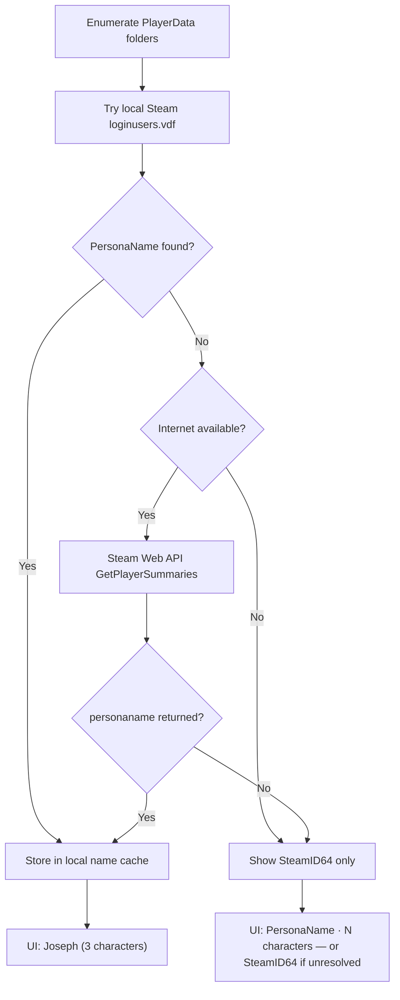
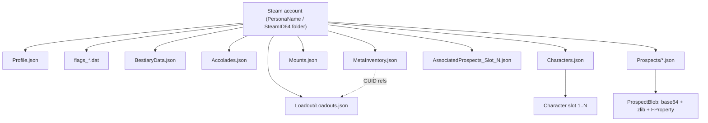
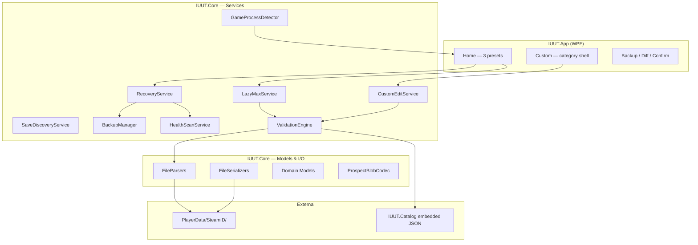
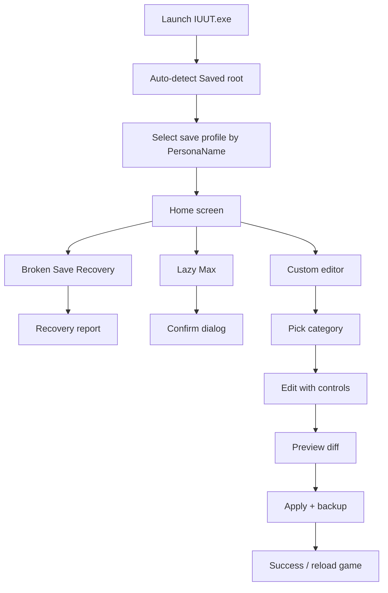

# Icarus Ultimate Utility Tool (IUUT)

**Master Project Documentation**

| | |
| --- | --- |
| **Full name** | Icarus Ultimate Utility Tool |
| **Short name / acronym** | IUUT |
| **Document version** | 1.3.1 |
| **Status** | Pre-development — documentation-first phase |
| **Target game** | Icarus (RocketWerkz, Unreal Engine 4, Windows) |
| **Verified against** | Mendel update (Week 220, Feb 2026), `Profile.DataVersion` = 4 |
| **Last updated** | 2026-05-25 |

---

## Table of contents

1. [Executive summary](#1-executive-summary)
2. [Project identity & positioning](#2-project-identity--positioning) — includes [terminology](#24-terminology--save-profile-vs-profilejson)
3. [Vision, goals & non-goals](#3-vision-goals--non-goals)
4. [Legal disclaimer & community framing](#4-legal-disclaimer--community-framing)
5. [Target users & personas](#5-target-users--personas)
6. [Platform & technology stack](#6-platform--technology-stack)
7. [Icarus client file layout](#7-icarus-client-file-layout) — includes [Steam display name resolution](#751-steam-display-name-resolution)
8. [Save data model (complete reference)](#8-save-data-model-complete-reference)
9. [Application architecture](#9-application-architecture)
10. [User experience design](#10-user-experience-design)
11. [Feature specification](#11-feature-specification)
12. [Preset specifications](#12-preset-specifications)
13. [Validation, safety & editing protocol](#13-validation-safety--editing-protocol)
14. [Game-state requirements](#14-game-state-requirements)
15. [Data catalogs & external references](#15-data-catalogs--external-references)
16. [Development roadmap](#16-development-roadmap)
17. [Repository & solution structure](#17-repository--solution-structure)
18. [Testing strategy](#18-testing-strategy)
19. [Packaging, distribution & releases](#19-packaging-distribution--releases)
20. [Future scope](#20-future-scope)
21. [Glossary](#21-glossary)
22. [Appendices](#22-appendices)
23. [Related documents](#23-related-documents)
24. [Revision history](#24-revision-history)

---

## 1. Executive summary

**Icarus Ultimate Utility Tool (IUUT)** is a Windows desktop application for viewing, repairing, and editing local Icarus save files. It is intended as an **unofficial community utility** — not affiliated with RocketWerkz or the game's publishers.

IUUT addresses two equally valid use cases:

1. **Save recovery** — corrupted JSON, crash mid-write, interrupted updates, Steam Cloud conflicts, characters stuck in prospects, partial data loss.
2. **Convenience editing** — max talents, currencies, accolades, bestiary, orbital stash management, and fine-grained tweaks without manual JSON surgery.

The application auto-detects the user's Icarus save root at `%LOCALAPPDATA%\Icarus\Saved\`, presents all Steam profiles found under `PlayerData\` **by Steam display name** (resolved via local Steam config and/or Steam Web API when online), and exposes three primary workflows from the home screen:

| Preset | Purpose |
| --- | --- |
| **Broken Save Recovery** | Scan, restore backups, template-repair unparseable files |
| **Lazy Max** | One-click intelligent max of core progression (non-breaking) |
| **Custom** | Full categorized editor with sliders, checkboxes, and visual stash UI |

Technical foundation: **.NET 8 + WPF**, self-contained single-file executable, empirically verified save formats documented in this file and the companion field guide `Icarus-Analysis.md`.

A proof-of-concept PowerShell script successfully modified `Characters.json` while the game was on the Main Menu. The game accepted the edit and, on load, clamped each over-ranked talent down to **that row's specific true max** — not to a universal Rank 4. The empirical post-load distribution on the live save was **~71 % rank 1 / ~9 % rank 2 / ~10 % rank 3 / ~10 % rank 4** (so "max talents" in practice means "unlock every talent and let the game settle each row to its own true max," which for the majority of player talents is Rank 1). *(Single observation — re-verify on each `DataVersion` bump.)*

---

## 2. Project identity & positioning

### 2.1 Naming

| Context | Name |
| --- | --- |
| Full product name | Icarus Ultimate Utility Tool |
| Acronym | **IUUT** |
| Executable (working) | `IUUT.exe` |
| Solution / repo (working) | `IcarusUltimateUtilityTool` |
| Core library (working) | `IUUT.Core` |

### 2.2 What IUUT is

- A **local file editor** for saves the user already owns on their PC
- A **recovery tool** with backup chains, health scans, and template repair
- A **user-friendly GUI** — no JSON knowledge required for normal use
- An **offline-capable tool** — save editing works without internet; optional online lookup for Steam display names (§7.5.1). No telemetry, accounts, or cloud upload

### 2.3 What IUUT is not

- Not a game trainer, memory injector, or process hook
- Not an online cheat or multiplayer exploit tool
- Not an official RocketWerkz product
- Not a cross-platform tool in v1 (Windows only, matching Icarus)
- Not a guarantee against save corruption — users must back up

### 2.4 Terminology — save profile vs Profile.json

Throughout IUUT documentation and UI, these terms are distinct:

| Term | Meaning | Example |
| --- | --- | --- |
| **Save profile** | The Steam account whose Icarus saves are being edited — **always shown by resolved PersonaName in UI** | **Joseph** |
| **SteamID64** | On-disk folder name under `PlayerData\`; secondary label in UI only | `00000000000000000` |
| **`Profile.json`** | Game save file (currencies, workshop unlocks) — not the same as "save profile" | File on disk |

**UI rule:** Any label reading **Profile:** in wireframes and mockups refers to the **save profile** (PersonaName), never the raw SteamID64 alone.

### 2.5 Positioning statement

> IUUT helps Icarus players recover broken saves and adjust local progression data. It edits the same JSON and binary files the game already reads/writes. Use at your own risk; always back up your `PlayerData` folder first.

---

## 3. Vision, goals & non-goals

### 3.1 Vision

Every Icarus player — whether they crashed mid-update, lost a character to a softlock, or simply don't want to grind another 40 hours for workshop unlocks — can fix or adjust their save through a polished, trustworthy Windows app.

### 3.2 Primary goals

| # | Goal |
| --- | --- |
| G1 | **Discover saves automatically** — resolve `%LOCALAPPDATA%\Icarus\Saved\`, enumerate `PlayerData\<SteamID>\`, **display Steam persona names** (not raw IDs alone) |
| G2 | **Recover corrupted saves** — backup restore chain + template repair + clear partial-recovery messaging |
| G3 | **Edit safely** — timestamped backups, round-trip validation, preview diff before write |
| G4 | **Max intelligently** — Lazy Max touches only proven-safe files; game clamps invalid values |
| G5 | **Fine-tune everything else** — Custom mode with proper UI controls per save category |
| G6 | **Visual orbital stash** — render stash items, durability, repair, swap, add/remove |
| G7 | **Ship as one `.exe`** — no prerequisites, double-click to run |

### 3.3 Non-goals (v1)

| # | Non-goal |
| --- | --- |
| NG1 | macOS / Linux builds |
| NG2 | In-world prospect blob item editing (requires full UE FProperty parser) |
| NG3 | Engine INI editing (`Config\WindowsNoEditor\`) — deferred to future "Engine Mods" |
| NG4 | Cosmetic editing (editable in-game; IUUT shows read-only except character name) |
| NG5 | Auto-filling orbital stash during Lazy Max (user choice in Custom) |
| NG6 | Enforcing Steam Cloud offline mode (recommendation only) |
| NG7 | Renaming `PlayerData\<SteamID>\` folders on disk — **display names are UI-only**; folder names must stay SteamID64 |
| NG8 | **An installer / setup wizard.** IUUT ships as a single double-click `.exe`. No MSI/EXE installer, no admin elevation, no registry writes, no Program Files install, no Start Menu / shortcut creation, no machine-wide changes. See §6.4. |

---

## 4. Legal disclaimer & community framing

### 4.1 In-app disclaimer (first launch)

> **Icarus Ultimate Utility Tool (IUUT)** is an unofficial community tool. It is not affiliated with RocketWerkz or anyone involved in publishing Icarus. IUUT modifies local save files on your computer only. You are responsible for backing up your saves before making changes. Multiplayer hosts should coordinate with their group before editing shared prospect files.

### 4.2 Steam Cloud recommendation (optional, settings/help)

> If you use Steam Cloud, verify sync direction after editing. Some users report local edits being overwritten by an older cloud copy. Consider confirming your local files are newer before launching, or launching offline once after a major edit. This is a recommendation, not enforced.

### 4.3 Open-source intent

MIT license recommended. Community catalog updates (new Mendel-era rows, etc.) via pull requests. Never commit real Steam IDs or character names in public fixtures.

---

## 5. Target users & personas

### Persona A — "My save is broken"

- **Situation:** Game won't load, character missing, JSON truncated, bad cloud merge
- **Needs:** Broken Save Recovery preset, health report, backup restore
- **Success:** Game launches, character roster visible, can enter prospect

### Persona B — "Fix one thing"

- **Situation:** XP debt, dead character, missing Genetics talents post-Mendel, stuck in prospect
- **Needs:** Custom mode — targeted category, preview diff
- **Success:** Single issue resolved without touching unrelated data

### Persona C — "Lazy max"

- **Situation:** Wants max talents, currencies, workshop, accolades, bestiary in one click
- **Needs:** Lazy Max preset with confirmation dialog
- **Success:** Four core files updated; game loads and clamps as expected

### Persona D — "Stash curator"

- **Situation:** Wants specific meta gear in orbital workshop, repaired durability, item swaps
- **Needs:** Custom → Orbital Stash visual grid
- **Success:** Stash reflects chosen items; loadout GUIDs remain consistent

### Persona E — Power user

- **Situation:** Prospect header edits, mount level bumps, raw JSON inspection
- **Needs:** Custom → Prospects, Mounts, Advanced/Raw
- **Success:** Surgical edits with full visibility

---

## 6. Platform & technology stack

### 6.1 Locked decisions

| Decision | Choice | Rationale |
| --- | --- | --- |
| **OS** | Windows 10/11 x64 only | Icarus is Windows-only |
| **Runtime** | .NET 8 | Native zlib, SHA-1, JSON, single-file publish |
| **UI** | WPF | Native controls, tree views, data binding, familiar on Windows |
| **Architecture** | Core library + thin WPF shell | Testable logic, clear separation |
| **JSON** | `System.Text.Json` + extension data | Round-trip unknown fields for forward compatibility |
| **Publish** | Self-contained single-file | `IUUT.exe`, ~15–25 MB, no .NET install required |

### 6.2 Solution projects

```
IcarusUltimateUtilityTool/
├── src/
│   ├── IUUT.Core/           # Parsers, mutators, validation, presets
│   ├── IUUT.Catalog/        # Embedded D_* table data
│   ├── IUUT.App/            # WPF application
│   └── IUUT.Cli/            # Optional headless CLI for tests/power users
├── tests/
│   └── IUUT.Core.Tests/
├── docs/
│   └── IUUT-PROJECT-DOCUMENTATION.md   # This file
├── catalogs/                # Build-time JSON from Eureka Endeavors
└── fixtures/                # Anonymized save snippets for tests
```

### 6.3 Publish command

```powershell
dotnet publish src/IUUT.App/IUUT.App.csproj `
  -c Release -r win-x64 `
  --self-contained true `
  -p:PublishSingleFile=true `
  -p:IncludeNativeLibrariesForSelfExtract=true
```

### 6.4 Acquisition & footprint (operator guarantees)

These are **binding product guarantees**, not aspirations. The operator-facing
runbook is `docs/INSTALL.md`.

#### Two acquisition paths — pick one

| Path | For whom | How |
| --- | --- | --- |
| **A — Pre-built signed download** | Most users | Download `IUUT.exe` from the GitHub **Releases** page, verify it against the published `SHA256SUMS.txt` and the GitHub build-provenance **attestation**, then double-click. No build tools needed. |
| **B — Build from source** | Anyone who wants to compile it themselves | Clone the repo and run the §6.3 publish command. Produces a byte-for-byte equivalent self-contained `IUUT.exe` they built and can trust without relying on our release. |

Both paths yield the **same** self-contained single-file `IUUT.exe`. Path B exists
so no user is ever forced to trust a binary they didn't build.

#### Integrity — "verified signed hashes"

Each GitHub Release carries:

- **`SHA256SUMS.txt`** — SHA-256 of `IUUT.exe` (and the portable zip).
- **A Sigstore build-provenance attestation** generated in CI by
  `actions/attest-build-provenance` — cryptographically ties the artifact to the
  exact workflow run and commit that produced it. Users verify with
  `gh attestation verify IUUT.exe --repo ImPanick/IUUT`.

This gives integrity **and** provenance with no certificate cost. Authenticode
code-signing (publisher identity, fewer SmartScreen prompts) is a **future upgrade**
gated on obtaining a code-signing certificate — see §19.

#### No-install, fire-and-forget

| Guarantee | Detail |
| --- | --- |
| **No prerequisites** | .NET 8 runtime is bundled (self-contained). User installs nothing. |
| **No installer** | Single `.exe`, double-click to run. No setup wizard (NG8). |
| **No admin / no UAC** | Manifest requests `asInvoker`. IUUT never elevates. |
| **No registry / no machine-wide changes** | IUUT writes nothing to the registry, Program Files, or any shared location. |
| **Known, minimal footprint** | All app state lives in **one** folder (next section). Removal = delete the `.exe` and that one folder. |

#### Application footprint (where IUUT writes)

| Mode | App state location | Notes |
| --- | --- | --- |
| **Default** | `%AppData%\IUUT\` | Steam name cache (`steam-profile-cache.json`), DPAPI-encrypted API key (`steam-api-key.bin`), logs (`Logs\`), settings. The **only** folder IUUT creates on the system. |
| **Portable** | `.\IUUT-Data\` (beside the `.exe`) | Activated when a file named `IUUT.portable` exists next to `IUUT.exe`. **Nothing** is written to `%AppData%`. True USB-stick fire-and-forget. |

Two footprint notes that are *not* "stray files":

- **Save backups** (`<File>.iuut-backup-<timestamp>`) are written **inside the game's
  own `PlayerData\<SteamID>\` folder**, alongside the files being edited — by design,
  per CONSTITUTION III. They are part of the save folder, not the system at large.
- **Single-file native extraction:** .NET single-file WPF extracts a few native
  libraries to a per-version temp directory on launch. IUUT pins this to a subfolder
  of its own state directory (default `%AppData%\IUUT\runtime\`, or `.\IUUT-Data\runtime\`
  in portable mode) via `DOTNET_BUNDLE_EXTRACT_BASE_DIR`, so it stays inside the one
  known footprint and never litters the system temp.

#### Clean removal

There is nothing to "uninstall." To remove IUUT completely: delete `IUUT.exe` and
the one state folder (`%AppData%\IUUT\` or the portable `.\IUUT-Data\`). Save files
and the user's own data are untouched.

---

## 7. Icarus client file layout

### 7.1 Root path resolution

IUUT resolves the Icarus saved-data root at launch:

```text
%LOCALAPPDATA%\Icarus\Saved\
```

Which expands per-user, e.g.:

```text
C:\Users\<WindowsUsername>\AppData\Local\Icarus\Saved\
```

**Implementation:** `Environment.GetFolderPath(Environment.SpecialFolder.LocalApplicationData)` + `\Icarus\Saved\`. Never hardcode a username.

**Auto-link, then manual fallback (operator guarantee):**

1. On launch, IUUT resolves the path above automatically. If it exists, the save root
   is linked with no user action — the user lands straight on the profile picker.
2. If the path is **not found** (game installed elsewhere, non-standard layout, moved
   `Saved\` folder), IUUT shows a clear "Couldn't find your Icarus saves — locate them"
   prompt with a **Browse…** button. The user points it at their `Saved\` (or
   `PlayerData\`) folder once; the chosen path is remembered in settings.
3. The resolved/overridden root is always visible and re-`Browse`-able from the home
   screen and Settings (F-001, F-002).

### 7.2 Top-level `Saved\` structure

```text
Saved\
├── Config\
│   └── WindowsNoEditor\          ← Engine/client INI files (future IUUT scope)
├── Crashes\                      ← Out of scope
├── ExtraData\                    ← Out of scope
├── Logs\                         ← Useful for diagnosing rejected saves (read-only)
├── PlayerData\                   ← **PRIMARY IUUT TARGET**
│   └── <SteamID64>\
├── SaveGames\                    ← Spectator settings; out of scope v1
└── Screenshots\                  ← Out of scope
```

### 7.3 Engine config zone (informational / future)

```text
Config\WindowsNoEditor\
├── Engine.ini              ← Render/engine cvars (future: fog disable)
├── GameUserSettings.ini    ← Graphics, resolution
├── Input.ini               ← Keybinds
├── Game.ini
└── ... (many empty stub INIs)
```

**v1 status:** Out of scope. Documented for future "Engine Mods" tab (§20).

### 7.4 Player save zone (meat & potatoes)

```text
PlayerData\<SteamID64>\
├── Profile.json
├── Characters.json
├── MetaInventory.json
├── Mounts.json
├── BestiaryData.json
├── Accolades.json
├── AssociatedProspects_Slot_1.json
├── AssociatedProspects_Slot_2.json
├── AssociatedProspects_Slot_3.json
├── flags_<SteamID64>.dat
├── steam_autocloud.vdf
├── Loadout\
│   └── Loadouts.json
├── Prospects\
│   └── <ProspectName>.json
├── MapData\
│   └── Terrain_XXX.fog
└── Mounts\
    └── <icon>.exr
```

### 7.5 Steam ID profiles

Each subfolder of `PlayerData\` is named after a **SteamID64** (17-digit string). One folder per Steam account that has played Icarus on this PC.

**Rules:**

- `Profile.json` → `UserID` **must equal** the folder name
- **On disk, the folder name is always SteamID64** — IUUT never renames save directories
- IUUT lists profiles in a dropdown using **human-readable Steam display names** when resolvable (see §7.5.1)
- Secondary line in dropdown: SteamID64, character count, last modified
- Multi-account PCs: user picks which profile to edit

#### 7.5.1 Steam display name resolution

Players should not have to memorize 17-digit Steam IDs. IUUT resolves each `PlayerData\<SteamID64>\` folder to the account's **Steam persona name** (`personaname`) for all UI labels — profile picker, home screen header, recovery reports, backup dialogs.



##### What changes vs what does not

| Layer | Behaviour |
| --- | --- |
| **Windows folder** | Stays `PlayerData\00000000000000000\` — **never renamed** |
| **Profile.json UserID** | Stays SteamID64 — **never edited** by resolver |
| **IUUT UI labels** | Show `PersonaName` as primary label |
| **IUUT logs / backups** | Include both PersonaName + SteamID64 for clarity |

##### Resolution sources (priority order)

| Priority | Source | Network | Notes |
| --- | --- | --- | --- |
| 1 | **IUUT name cache** | Offline OK | `%AppData%\IUUT\steam-profile-cache.json` — TTL e.g. 7 days |
| 2 | **Local Steam `loginusers.vdf`** | Offline OK | Accounts that have logged into Steam on this PC |
| 3 | **Steam Web API** | **Requires internet** | `ISteamUser/GetPlayerSummaries/v2/` |
| 4 | **Fallback** | Offline OK | Raw SteamID64 string |

##### Local Steam config (offline-first)

Steam stores persona names for accounts on the machine:

```text
<SteamInstall>\config\loginusers.vdf
```

Example structure (Valve KeyValues format):

```text
"00000000000000000"
{
    "AccountName"   "josep"
    "PersonaName"   "Joseph"
    "MostRecent"    "1"
    ...
}
```

**Discovery of Steam install path:**

1. Registry: `HKCU\Software\Valve\Steam` → `SteamPath`
2. Fallback common paths: `C:\Program Files (x86)\Steam\`, `D:\Steam\`

Parse `PersonaName` keyed by SteamID64. No API key required. Works offline for accounts that have used Steam on this PC.

##### Steam Web API (online resolver)

When local data is missing or stale, IUUT calls:

```http
GET https://api.steampowered.com/ISteamUser/GetPlayerSummaries/v2/
    ?key={API_KEY}
    &steamids={SteamID64}
```

Response field used: `response.players[0].personaname`

**Batching:** Up to 100 SteamIDs per request (comma-separated) when resolving multiple profiles at once.

**API key handling:**

| Mode | Detail |
| --- | --- |
| **User key (recommended)** | Settings → paste key from [steamcommunity.com/dev/apikey](https://steamcommunity.com/dev/apikey) — tied to user's Steam account, no shared rate limit |
| **Bundled key (optional fallback)** | Ship a project-owned key for convenience; document shared rate-limit risk; user can override in Settings |

**Privacy profiles:** If `communityvisibilitystate` is Private/Friends-only, `personaname` may be omitted or limited. Fall back to SteamID64 + note *"Profile private — name unavailable"*.

##### Caching

```json
{
  "version": 1,
  "entries": {
    "00000000000000000": {
      "personaName": "Joseph",
      "resolvedAt": "2026-05-25T14:30:00Z",
      "source": "steam-api"
    }
  }
}
```

- Cache path: `%AppData%\IUUT\steam-profile-cache.json` (in portable mode: `.\IUUT-Data\steam-profile-cache.json`) — see §6.4 footprint
- Refresh on profile scan if entry missing or older than TTL (default 7 days)
- **Refresh names** button in Settings / profile dropdown
- Offline after first resolve: cached names still display

##### UI presentation

**Profile dropdown entry:**

```text
Joseph                          ← primary (PersonaName)
00000000000000000 · 3 chars     ← secondary (SteamID64 + metadata)
```

**Home screen header:**

```text
Profile:  Joseph  [▼]
          00000000000000000
```

**Offline / unresolved states:**

| State | Display |
| --- | --- |
| Cached name available | PersonaName |
| Local vdf only | PersonaName (source: local) |
| API success | PersonaName (source: online) |
| No internet, no cache | `00000000000000000` + tooltip *"Connect to resolve Steam name"* |
| Private profile | SteamID64 + *"Private profile"* |

##### Settings (Steam resolver)

| Setting | Default | Purpose |
| --- | --- | --- |
| Enable Steam name resolution | On | Master toggle |
| Steam Web API key | Empty | User-provided key for online lookup |
| Cache TTL (days) | 7 | How long cached names are trusted |
| Refresh on launch | On | Re-resolve stale entries when online |

##### Feature IDs

See **F-003**, **F-006**, **F-007** in §11.1.

##### Implementation service

`SteamProfileResolverService` in `IUUT.Core`:

```csharp
// Conceptual
Task<SteamProfileDisplay> ResolveAsync(string steamId64);
Task<IReadOnlyList<SteamProfileDisplay>> ResolveAllAsync(IEnumerable<string> steamId64s);

record SteamProfileDisplay(
    string SteamId64,
    string? PersonaName,
    SteamNameSource Source,  // Cache, LocalVdf, SteamApi, Fallback
    DateTimeOffset? ResolvedAt
);
```

**Important:** Resolver is read-only metadata — never writes to save files or renames folders.

##### Internet connectivity

- Online resolution requires active internet when cache + local vdf miss
- IUUT checks connectivity before API call; skips gracefully if offline
- Optional: small cloud/offline icon in profile picker indicating name source
- First launch on new PC without cache: may show SteamID64 until user goes online once (or logs into Steam locally)


### 7.6 Backup rotation (game-managed)

The game rotates backups on clean shutdown — **but the convention is per-file and rotation is NOT universal**:

| Pattern | Files using it | Notes |
| --- | --- | --- |
| `File.json.backup` + `File.json.backup_1` … `_10` | Profile, Characters, Accolades, BestiaryData, Mounts, Prospects\*.json | Standard rotation; up to 11 files per save (the live + 10 history) |
| `File.json.<N>.backup` | Loadout\Loadouts.json | Different naming! Only one observed (`Loadouts.json.4.backup`) |
| *(no rotation)* | MetaInventory.json, AssociatedProspects_Slot_*.json, flags_*.dat, steam_autocloud.vdf, MapData\*.fog, Mounts\*.exr | The game never rotates these — they have **zero** backups on disk |

**Implications for IUUT:**

- **Recovery must handle "no backup candidates" gracefully.** For files in the third row, the backup-chain walk returns an empty set; IUUT falls through to template repair (or refuses to repair, depending on file). See §12.1.
- **IUUT's own pre-write backup is the *only* safety net** for `MetaInventory.json` and `AssociatedProspects_*.json`. Always create the `.iuut-backup-*` copy before writing these files even though there is no rotation to "fall back to".
- **The walker globs `<File>.*backup*`** (rather than iterating a fixed `.backup` / `.backup_<N>` list) so that the Loadouts `.<N>.backup` convention is picked up automatically.

**IUUT rule for prospects:** if ≥ 2 clean backup candidates exist, prefer the **second-newest** — the freshest may be the corrupted in-memory flush.

**IUUT rule for all edits:** create own timestamped backup (`File.json.iuut-backup-20260525-143022`) before any write. Do not rely solely on game backups.

### 7.7 JSON encoding conventions

| Property | Game writes | IUUT writes |
| --- | --- | --- |
| Encoding | UTF-8 **without BOM** | UTF-8 without BOM |
| Line endings | CRLF | CRLF preferred; game tolerates LF |
| Indent | Tabs | Spaces OK — game parser tolerant; byte format may differ |

---

## 8. Save data model (complete reference)

### 8.1 High-level relationships



**Conceptual split:**

| Layer | Files | Contains |
| --- | --- | --- |
| **Account meta** | Profile, Accolades, Bestiary, flags | Currencies, workshop unlocks, achievements, scan progress |
| **Character roster** | Characters.json | Names, XP, talents, cosmetics, death state — **not** in-world inventory |
| **Orbital layer** | MetaInventory, Loadouts | Workshop stash + drop-in loadouts (GUID-linked) |
| **World layer** | AssociatedProspects, Prospects | Prospect index + actual world saves (binary blobs) |
| **Companion data** | Mounts, MapData | Tamed animals, fog-of-war maps |

---

### 8.2 Profile.json

**Purpose:** Account-wide meta surviving character deletion.

**Shape:**

```json
{
    "UserID": "00000000000000000",
    "MetaResources": [
        { "MetaRow": "Refund", "Count": 31 },
        { "MetaRow": "Credits", "Count": 5840 },
        { "MetaRow": "Exotic1", "Count": 37 },
        { "MetaRow": "Exotic_Red", "Count": 959 },
        { "MetaRow": "Biomass", "Count": 5 },
        { "MetaRow": "Licence", "Count": 0 },
        { "MetaRow": "Exotic_Uranium", "Count": 25 }
    ],
    "UnlockedFlags": [ 5, 26, 1, 63, 60, 66, 67, 7, 24, 45, 86, 93 ],
    "Talents": [
        { "RowName": "Workshop_Envirosuit", "Rank": 1 },
        { "RowName": "Prospect_OLY_Forest_Recon", "Rank": 1 }
    ],
    "NextChrSlot": 4,
    "DataVersion": 4
}
```

#### Field reference

| Field | Type | IUUT behaviour |
| --- | --- | --- |
| `UserID` | string | **Read-only** — must match folder name |
| `MetaResources` | `{MetaRow, Count}[]` | Sliders/spinners per currency |
| `UnlockedFlags` | int[] | Add/remove with warning (no ID legend v1) |
| `Talents` | `{RowName, Rank}[]` | Workshop unlock checklist — all ranks = 1 |
| `NextChrSlot` | int | **Read-only display** — do not decrement below max ChrSlot + 1 |
| `DataVersion` | int | **Read-only** — preserve for migration; currently `4` (Mendel) |

#### Known MetaRow keys

| MetaRow | In-game name |
| --- | --- |
| `Credits` | Ren credits |
| `Refund` | Refund tokens |
| `Exotic1` | Standard exotics |
| `Exotic_Red` | Red exotics |
| `Exotic_Uranium` | Uranium exotics |
| `Biomass` | Biomass (Mendel) |
| `Licence` | Faction licence |

**Editor rules:** One entry per MetaRow; duplicates overwrite. Unknown rows round-trip verbatim. Game may clamp extreme values.

#### Profile Talents ≠ Character Talents

`Profile.Talents` = **workshop blueprint unlocks** (`Workshop_*`, `Prospect_*` prefixes). Rank is always 1 (binary unlock). Character skill trees live in `Characters.json`.

---

### 8.3 Characters.json

**Purpose:** Character roster — all slots on the account.

**Container shape (critical):** Outer JSON with single key `"Characters.json"` whose value is an array of **JSON-stringified** character objects.

```json
{
    "Characters.json": [
        "{\n\t\"CharacterName\": \"PANICK\", ... }",
        "{\n\t\"CharacterName\": \"IM PANICKING\", ... }"
    ]
}
```

**Parse pipeline:**

1. Deserialize outer object
2. For each string in array → deserialize inner character
3. Modify character objects
4. Re-serialize each inner object to string
5. Re-serialize outer wrapper
6. Write UTF-8 no BOM

#### Character record fields

| Field | Type | IUUT behaviour |
| --- | --- | --- |
| `CharacterName` | string | **Editable** (only cosmetic-adjacent field editable) |
| `ChrSlot` | int | Read-only — stable slot ID |
| `XP` | int64 | Slider/spinner; Lazy Max → ≥ 80,000,000 |
| `XP_Debt` | int64 | Slider; Lazy Max → 0 |
| `Talents` | `{RowName, Rank}[]` | Tree browser, rank 0–4 |
| `IsDead` | bool | Toggle; Lazy Max → false |
| `IsAbandoned` | bool | Toggle; Lazy Max → false |
| `LastProspectId` | string | Read-only display |
| `Location` | string | Read-only display |
| `UnlockedFlags` | int[] | Advanced edit with warning |
| `MetaResources` | `{MetaRow, Count}[]` | Usually empty; editable if present |
| `Cosmetic` | object | **Read-only display** |

#### Talent RowName prefixes (recipe/category, NOT tree)

The `RowName` prefix identifies the recipe / item / mechanic family — **not** the in-game skill tree. The tree grouping (Hunting, Construction, Genetics, …) is a separate field in `D_Talents` and must be fetched from the catalog. Empirically only `Genetics_*` happens to match its tree name 1:1.

Top observed prefixes on the live save (counts = total `RowName` instances across all 3 characters):

| Prefix family | Examples | Count |
| --- | --- | --- |
| Material/refining | `Wood_*`, `Iron_*`, `Stone_*`, `Concrete_*`, `Obsidian_*`, `Steel_*`, `Titanium_*` | 30–96 each |
| Weapons | `Bow_*`, `Knife_*`, `Spear_*`, `Crossbow_*`, `Hammer_*`, `Pistol_*`, `Rifle_*`, `Shotgun_*` | 12–63 each |
| Mechanic perks | `Solo_*`, `Exploration_*` | 81 each |
| Resource/advanced | `Resources_*`, `Advanced_*` | 72 each |
| Building/tools | `Building_*`, `Tools_*` | 66 each |
| Husbandry/fishing | `Husbandry_*`, `Fishing_*` | 57 each |
| **Genetics (Mendel)** | `Genetics_*` | 48 (16 unique × 3 chars) |
| Top-level tree perks | `Hunting_*`, `Combat_*`, `Cooking_*`, `Crafting_*` | 3–15 each |

See field guide §4.2 for the reproducible PowerShell extraction and the full ~200-prefix histogram.

**Talent editing rules:**

- One `RowName` per character — no duplicates
- Max rank is **row-specific** and mostly Rank 1. Empirical distribution after a "set everything to Rank 4" edit + game load: **~71% rank 1 / ~9% rank 2 / ~10% rank 3 / ~10% rank 4** (live save, 1067-row union, 2026-05-12 edit). The game accepts an over-ranked input and clamps each row independently to its true max — so "Max all talents" in practice means "unlock everything and accept the per-row clamp," not "everything at Rank 4." (Single observation; re-verify on each `DataVersion` bump.)
- Skip `*_Reroute*` visual path nodes (no rewards)
- Adding talents safe; removing talents that baked into world structures risky

#### Mendel Genetics tree (16 functional rows, RowName prefix `Genetics_`)

Tree display name: **Genetics**. Earlier IUUT drafts referred to this as `Construction_Genetics` — that string does **not** appear in any observed save and is treated as an outdated guess. All 16 functional rows confirmed present on the live save.


```
Genetics_GestationSpeed       Genetics_GestationBuff        Genetics_RecoverySpeed
Genetics_GenotypeMutation     Genetics_GenotypeMutation2
Genetics_PhenotypeMutation    Genetics_PhenotypeMutation2
Genetics_WildGenome           Genetics_WildPhenome          Genetics_WildBloodline
Genetics_SireBuff             Genetics_MaternalBuff
Genetics_Twins                  Genetics_Lineage              Genetics_Experience
Genetics_Reduced_Threat
```

Skip: `Genetics_Mutation_Reroute`, `Genetics_Reroute2`, `Genetics_Reroute3`

#### Cosmetic block (read-only in IUUT)

```json
"Cosmetic": {
    "IsMale": true,
    "Customization_Head": 12,
    "Customization_Body": 4,
    "Customization_HeadColors": "...",
    "Customization_BodyColors": "...",
    "Customization_HeadPaint": 0,
    "Customization_BodyPaint": 0,
    "Customization_Scar": 0,
    "Customization_FacialHair": 0,
    "Customization_Hair": 7,
    "Customization_HairColor": "...",
    "Customization_EyeColor": "...",
    "Customization_VoiceID": 3
}
```

Editable in-game natively. IUUT displays for reference only.

---

### 8.4 Accolades.json

**Purpose:** Achievement / accolade completion log.

**Shape:**

```json
{
    "CompletedAccolades": [
        {
            "Accolade": {
                "RowName": "TutorialCompleted",
                "DataTableName": "D_Accolades"
            },
            "TimeCompleted": "2023.07.13-05.27.15",
            "ProspectID": "F9F6283642434EAEEA7CD489BC9C3F86"
        }
    ]
}
```

| Field | IUUT behaviour |
| --- | --- |
| `Accolade.RowName` | From `D_Accolades` catalog |
| `TimeCompleted` | Format `YYYY.MM.DD-HH.MM.SS` — auto-generate on add |
| `ProspectID` | Can use last-known GUID or empty string |

**Lazy Max:** Append all catalog accolades not already present.

---

### 8.5 BestiaryData.json

**Purpose:** Bestiary scan point progress per creature group.

**Shape:**

```json
{
    "BestiaryTracking": [
        {
            "BestiaryGroup": {
                "RowName": "Forest_Wolf",
                "DataTableName": "D_BestiaryData"
            },
            "NumPoints": 1046
        }
    ]
}
```

**Lazy Max:** Set `NumPoints` to catalog max (or high value); add missing groups from catalog.

---

### 8.6 MetaInventory.json

**Purpose:** Orbital workshop stash — items crafted above the planet.

**Shape:**

```json
{
    "InventoryID": "MetaInventoryID_Main",
    "Items": [ /* item records */ ]
}
```

#### Item record

```json
{
    "ItemStaticData": {
        "RowName": "Envirosuit_Tier2",
        "DataTableName": "D_ItemsStatic"
    },
    "ItemDynamicData": [
        { "PropertyType": "ItemableStack", "Value": 1 },
        { "PropertyType": "Durability", "Value": 5500 }
    ],
    "ItemCustomStats": [],
    "CustomProperties": {
        "StaticWorldStats": [],
        "StaticWorldHeldStats": [],
        "Stats": [],
        "Alterations": [],
        "LivingItemSlots": []
    },
    "DatabaseGUID": "F44CB30140004789820E20B75577DEA1",
    "ItemOwnerLookupId": -1,
    "RuntimeTags": { "GameplayTags": [] }
}
```

| Field | IUUT behaviour |
| --- | --- |
| `ItemStaticData.RowName` | Display name from catalog; Replace swaps this |
| `ItemDynamicData` | Edit `Durability`, `ItemableStack` |
| `DatabaseGUID` | Unique per item; generate fresh GUID on add |
| `ItemOwnerLookupId` | Always `-1` for stash items |

**Orbital Stash UI (Custom):** Visual grid, durability bars, Repair / Replace / Add / Remove. Warn if GUID referenced in Loadouts.

**Not in Lazy Max** — user curates stash manually.

---

### 8.7 Loadout\Loadouts.json

**Purpose:** Per-prospect drop-in loadouts linking character slot → envirosuit + meta items.

**Outer shape:** `{ "Loadouts": [ ... ] }`

Each entry contains:

| Field | Notes |
| --- | --- |
| `EnviroSuit` | MetaInventory-shaped item |
| `Dropship` | Dropship parts (TOP/MID/BTM) |
| `MetaItems` | Array of stash-shaped items |
| `AssociatedProspect` | Prospect association record |
| `HostedBy` | Steam P2P / local / dedicated server info |
| `ChrSlot` | Must match Characters.json slot |
| `Guid` | Loadout-level ID (independent of item GUIDs) |
| `bInsured`, `bSettled` | Insurance / settlement flags |
| `LoadoutClaimTime` | Unix epoch seconds |

**GUID coupling:** Item GUIDs in loadouts may reference MetaInventory. Restore MetaInventory + Loadouts together. Removing stash items referenced by loadouts → warn.

---

### 8.8 AssociatedProspects_Slot_N.json

**Purpose:** Per-character index of claimed prospects (Continue menu).

Same nested stringified-array pattern as Characters.json. One file per character slot (1, 2, 3, …).

**Key fields in inner blob:**

| Field | IUUT behaviour |
| --- | --- |
| `ProspectID` | Display + delete to unstick |
| `ProspectState` | Active / Completed / Failed — radio buttons |
| `Difficulty` | Easy / Medium / Hard / Extreme |
| `Insurance` | Checkbox |
| `AssociatedMembers` | Member list viewer |

**Recovery use:** Delete phantom association to free stuck character.

---

### 8.9 Prospects\<Name>.json

**Purpose:** World save — JSON header + compressed binary blob.

**Filename:** an arbitrary user/system-chosen string — *not* constrained to `Outpost*` / `Pro_*`. Live examples seen on one save: `Olympus.json`, `PGH-5.json`, `Kiara&Joseph.json`, `RedExoticFarming.json`, and GUID-named files like `5A8854EE4B2F1206479B6EB900BEC08B.json` (host-shared). IUUT should:

- Discover prospects by globbing `Prospects\*.json` (NOT by matching a name pattern).
- Use `ProspectInfo.ProspectID` (display) and `ProspectDTKey` (data-table key, e.g. `Outpost006_Olympus`) as the stable identifiers — never the filename string.
- Render filenames as-is in the UI; do not try to "normalize" them.

**Shape:**

```json
{
    "ProspectInfo": { /* header — editable safely */ },
    "ProspectBlob": {
        "Key": "actors",
        "Hash": "<sha1 of uncompressed bytes>",
        "TotalLength": 60870,
        "DataLength": 60870,
        "UncompressedLength": 2769682,
        "BinaryBlob": "eJzs3Ql4E9XaB/..."
    }
}
```

#### ProspectBlob encoding (verified)

**Decompression:**

1. `BinaryBlob` = standard base64
2. Decoded bytes start with `78 9C` (zlib header)
3. Strip 2-byte zlib header → raw deflate → `UncompressedLength` bytes
4. Content = UE FProperty `StateRecorderBlob` stream
5. `Hash` = SHA-1 of **uncompressed** bytes

**Recompression (asymmetric — strict zlib decoders reject a missing trailer):**

1. Raw-deflate the uncompressed bytes
2. Prepend the 2-byte zlib header `78 9C`
3. Append a 4-byte **big-endian Adler-32 of the UNCOMPRESSED bytes**
4. Base64-encode; update `Hash`, `UncompressedLength`, `TotalLength`, `DataLength`

**Implementation:** Use .NET's `System.IO.Compression.ZLibStream` (handles header + deflate + Adler-32 trailer in one pass). Do **not** hand-stitch with `DeflateStream` + manual header bytes — the Adler-32 trailer is easy to forget and causes silent load-time rejection.

**IUUT v1:** Header edits safe. Blob verify (hash check) + backup restore. Blob mutation deferred.

**Sizes:** ~20 KB (fresh) to ~870 KB compressed / ~3 MB uncompressed (heavily built).

---

### 8.10 Mounts.json

**Purpose:** Tamed mount roster.

**Shape:** `{ "SavedMounts": [ ... ] }`

Each mount:

| JSON field | Notes |
| --- | --- |
| `MountName` | Editable in Custom |
| `MountLevel` | Editable — denormalized UI copy |
| `MountType` | e.g. `Arctic_Moa` |
| `MountIconName` | Links to `Mounts\<id>.exr` |
| `RecorderBlob.BinaryData` | UE FProperty bytes as int[] — actual world state |

JSON-only edits sufficient for UI fixes; binary holds authoritative stats/talents.

---

### 8.11 flags_<SteamID>.dat

**Purpose:** Binary engine unlock flags (separate namespace from Profile.UnlockedFlags).

**Layout (82 bytes observed, N = 14 flags):**

```text
offset  size  field
0       4     u32      length prefix = 18 (17 chars + NUL)
4       17   ASCII     SteamID (17-char SteamID64)
21      1     u8       NUL terminator (0x00)
22      4     u32      flag count N
26      N*4  u32[]     flag IDs (little-endian)
```

The length prefix follows standard UE `FString` semantics and **includes the trailing NUL**, so a 17-char SteamID64 yields prefix = 18 (0x12). Total: 4 + 17 + 1 + 4 + N*4 = 82 when N = 14.

Custom mode: flag ID checklist. Not in Lazy Max.

---

### 8.12 Out-of-scope files (v1)

| File | Reason |
| --- | --- |
| `MapData\*.fog` | Opaque fog-of-war bitmap — delete to reset only |
| `Mounts\*.exr` | Portrait textures |
| `steam_autocloud.vdf` | Steam manifest — read-only |
| `Config\*.ini` | Future Engine Mods (§20) |

---

## 9. Application architecture

### 9.1 Layer diagram



### 9.2 Core services

| Service | Responsibility |
| --- | --- |
| `SaveDiscoveryService` | Resolve Saved root, enumerate SteamID64 folders, attach resolved PersonaNames |
| `SteamProfileResolverService` | Resolve SteamID64 → PersonaName (local vdf, cache, Steam Web API) |
| `BackupManager` | Timestamped `.iuut-backup-*` copies; optional full-folder zip |
| `HealthScanService` | Parse every JSON file; verify prospect SHA-1; report status |
| `RecoveryService` | Backup chain walk, template repair, partial-recovery flag |
| `LazyMaxService` | Apply core max to 4 files atomically (with backup) |
| `CustomEditService` | Category-scoped mutations with dirty tracking |
| `ValidationEngine` | Pre/post save checks; block on hard fail |
| `GameProcessDetector` | Detect `Icarus-Win64-Shipping.exe`; drive warning banner |
| `ProspectBlobCodec` | base64 → zlib → deflate → SHA-1 verify/re-encode |

### 9.3 Session model

On **save profile** selection, IUUT loads all parseable files into an in-memory **SaveSession**:

```csharp
// Conceptual — not final API
SaveSession {
    string SteamId;
    string? SteamPersonaName;      // from SteamProfileResolverService
    SteamNameSource NameSource;    // Cache, LocalVdf, SteamApi, Fallback
    string ProfilePath;
    ProfileModel Profile;
    CharactersModel Characters;
    AccoladesModel Accolades;
    BestiaryModel Bestiary;
    MetaInventoryModel MetaInventory;
    // ... etc
    Dictionary<string, FileHealth> HealthReport;
    bool IsDirty;
}
```

Mutations mark session dirty. **Apply** writes only changed files after validation + backup.

---

## 10. User experience design

### 10.1 Application flow



### 10.2 Home screen

```
┌──────────────────────────────────────────────────────────────────┐
│  Icarus Ultimate Utility Tool (IUUT)                 [⚙ Settings]│
├──────────────────────────────────────────────────────────────────┤
│  Save root:  C:\Users\...\AppData\Local\Icarus\Saved      [Browse]│
│  Profile:    Joseph                                    [▼]         │
│              00000000000000000 · 3 characters                    │
│  Health:     ● 12/12 JSON OK                                     │
│  Game:       ○ Not running (safest)  — or —  ⚠ Main Menu only   │
│  Steam:      ☁ Names resolved online  — or —  📴 Offline (cached)  │
├──────────────────────────────────────────────────────────────────┤
│                                                                  │
│   ┌─────────────────┐  ┌─────────────────┐  ┌─────────────────┐│
│   │  🚑 BROKEN SAVE │  │  ⚡ LAZY MAX    │  │  🎛 CUSTOM      ││
│   │    RECOVERY     │  │                 │  │                 ││
│   └─────────────────┘  └─────────────────┘  └─────────────────┘│
│                                                                  │
│  [💾 Backup Joseph's save]  [🔍 Full health report]              │
└──────────────────────────────────────────────────────────────────┘
```

### 10.3 Custom mode — sidebar categories

| # | Category | Primary controls |
| --- | --- | --- |
| 1 | Account & Currencies | Sliders per MetaResource |
| 2 | Workshop Blueprints | Searchable checkbox list |
| 3 | Account Flags | Add/remove int list |
| 4 | Characters | Per-slot: name, XP, debt, dead/abandoned |
| 5 | Talents | Tree + rank sliders, bulk max buttons |
| 6 | Cosmetics | Read-only viewer |
| 7 | Accolades | Completed/missing checklist |
| 8 | Bestiary | Points slider per creature group |
| 9 | Orbital Stash | Visual grid, repair, replace, add, remove |
| 10 | Loadouts | Per-prospect viewer |
| 11 | Prospects (index) | Unstick, state, difficulty |
| 12 | Prospects (worlds) | Header editor, blob hash status |
| 13 | Mounts | Name, level, type |
| 14 | Engine Flags | `flags_*.dat` checklist |
| 15 | Advanced / Raw | JSON viewer, export |

Every category: **Preview Changes → Apply** with diff summary.

### 10.4 Orbital Stash UI (signature Custom feature)

```
┌──────────────────────────────────────────────────────────────────┐
│  Orbital Stash (47 items)                    [+ Add Item]        │
├──────────────────────────────────────────────────────────────────┤
│  ┌─────────────┐  ┌─────────────┐  ┌─────────────┐              │
│  │ Envirosuit  │  │ Meta Pick   │  │ Meta Bow    │  ...         │
│  │ Tier 2      │  │ Shengong    │  │ Inaris D    │              │
│  │ ████████░░  │  │ ██████████  │  │ ███░░░░░░░  │              │
│  │ 4400/5500   │  │ [Repair]    │  │ [Repair][↔] │              │
│  └─────────────┘  └─────────────┘  └─────────────┘              │
│  Detail: RowName, GUID, stack, durability, catalog max           │
│  [Repair to Max] [Replace...] [Remove]                           │
└──────────────────────────────────────────────────────────────────┘
```

### 10.5 UI control mapping

| Data type | Control |
| --- | --- |
| bool | Checkbox |
| int / int64 | Slider + numeric spinner |
| enum (Difficulty, etc.) | Radio button group |
| catalog row pick | Searchable list with checkboxes |
| talent rank | Slider 0–4 or tree node spinner |
| item durability | Progress bar + Repair button |
| read-only | Greyed text / icon display |

---

## 11. Feature specification

### 11.1 Save discovery & save profile selection

| ID | Feature | Acceptance criteria |
| --- | --- | --- |
| F-001 | Auto-detect Saved root | Finds `%LOCALAPPDATA%\Icarus\Saved\` on launch |
| F-002 | Manual path override | Settings → browse to alternate Saved folder |
| F-003 | Save profile dropdown | Lists profiles by **PersonaName** (primary); SteamID64 + metadata (secondary) |
| F-004 | Save profile metadata | Character count, last modified, parse status, name resolution source |
| F-005 | Health summary on Home | Count of OK vs broken JSON files |
| F-006 | Steam name — local resolve | Read `loginusers.vdf` PersonaName offline |
| F-007 | Steam name — API resolve | `GetPlayerSummaries` when online; cache results |
| F-008 | Steam name cache | Persist resolved names; TTL refresh; offline display |

### 11.2 Backup & safety

| ID | Feature | Acceptance criteria |
| --- | --- | --- |
| F-010 | Pre-write backup | Every Apply creates `.iuut-backup-<timestamp>` |
| F-011 | Backup entire save profile | Zip/copy full SteamID64 folder for selected PersonaName |
| F-012 | Preview diff | Show human-readable change summary before Apply |
| F-013 | Round-trip validation | Re-parse after write; abort + restore on failure |
| F-014 | Game process banner | Warn when Icarus running; recommend closed or Main Menu |

### 11.3 Broken Save Recovery

| ID | Feature | Acceptance criteria |
| --- | --- | --- |
| F-020 | Full health scan | Parse all JSON; SHA-1 all prospect blobs |
| F-021 | Backup chain restore | Glob `<File>.*backup*` (covers `.backup`, `.backup_<N>`, `.<N>.backup`); rank by parse-OK + mtime; restore newest clean |
| F-022 | Prospect backup preference | For prospects with ≥2 clean candidates, pick the **second-newest** (freshest may be the corrupted in-memory flush) |
| F-023 | Template repair | Rebuild valid skeleton + merge salvageable data |
| F-024 | Partial recovery flag | Prominent message → use Custom tab |
| F-025 | Recovery report | Per-file: OK / restored / template / failed |

### 11.4 Lazy Max

| ID | Feature | Acceptance criteria |
| --- | --- | --- |
| F-030 | Max characters | Talents @4, XP≥80M, debt=0, revive |
| F-031 | Max profile | All MetaResources high; all Workshop_/Prospect_ @1 |
| F-032 | Max accolades | All D_Accolades appended |
| F-033 | Max bestiary | All groups max NumPoints |
| F-034 | Confirmation dialog | Lists 4 files + character count before apply |
| F-035 | Post-nudge | Optional link to Custom → Orbital Stash |

### 11.5 Custom — Characters & Talents

| ID | Feature | Acceptance criteria |
| --- | --- | --- |
| F-040 | Character list | All slots with XP, talent count, status badges |
| F-041 | Edit character name | Single editable cosmetic-adjacent field |
| F-042 | XP / debt sliders | Per character |
| F-043 | Dead / abandoned toggles | Per character |
| F-044 | Talent tree browser | Grouped by prefix, catalog display names |
| F-045 | Talent search | Filter by name |
| F-046 | Bulk tree max | Max single tree or all trees per character |
| F-047 | Cosmetics viewer | Read-only display |

### 11.6 Custom — Account

| ID | Feature | Acceptance criteria |
| --- | --- | --- |
| F-050 | Currency sliders | All known MetaRow keys |
| F-051 | Workshop checklist | All Workshop_* / Prospect_* from catalog |
| F-052 | Account flags editor | Add/remove UnlockedFlags with warning |

### 11.7 Custom — Accolades & Bestiary

| ID | Feature | Acceptance criteria |
| --- | --- | --- |
| F-060 | Accolade checklist | Completed vs missing filter |
| F-061 | Add accolade | Pick from catalog, auto timestamp |
| F-062 | Bestiary sliders | NumPoints per group |

### 11.8 Custom — Orbital Stash

| ID | Feature | Acceptance criteria |
| --- | --- | --- |
| F-070 | Stash grid render | Cards with catalog names |
| F-071 | Durability display | Bar + numeric current/max |
| F-072 | Repair item | Set durability to catalog max |
| F-073 | Replace item | Swap RowName; handle GUID rules |
| F-074 | Add item | Pick from D_ItemsStatic; fresh GUID |
| F-075 | Remove item | Warn if loadout reference exists |

### 11.9 Custom — Prospects, Loadouts, Mounts

| ID | Feature | Acceptance criteria |
| --- | --- | --- |
| F-080 | Loadout viewer | EnviroSuit + MetaItems per prospect |
| F-081 | Unstick character | Delete AssociatedProspects entry |
| F-082 | Prospect header edit | State, difficulty, insurance |
| F-083 | Blob hash status | OK / mismatch / unreadable |
| F-084 | Mount editor | Name, level, type (JSON fields) |
| F-085 | flags_*.dat editor | Add/remove flag IDs |

### 11.10 Advanced

| ID | Feature | Acceptance criteria |
| --- | --- | --- |
| F-090 | Raw JSON viewer | Read-only per file |
| F-091 | Export file | Save copy to user-chosen path |
| F-092 | Import file | Replace with user file + validate |

---

## 12. Preset specifications

### 12.1 Broken Save Recovery

**Trigger:** Home card → confirm → run

**Algorithm:**

```
FOR each file in selected save profile folder (PlayerData/<SteamID64>/):
  IF file parses cleanly AND (prospect: SHA-1 OK):
    mark OK
  ELSE:
    # Glob ALL siblings matching <File>.*backup* — do NOT assume a fixed
    # naming list. Observed conventions in the wild include `.backup`,
    # `.backup_1` … `.backup_10` (most files) and `.<N>.backup`
    # (e.g. `Loadouts.json.4.backup` — see Icarus-Analysis.md §10).
    candidates = glob("<File>.*backup*")
    rank candidates by: (parses cleanly?, prospect-SHA1-OK?, mtime desc)
    # Prospect override (game-observed): the freshest backup may be the
    # corrupted in-memory flush, so prefer the second-newest clean parse.
    IF file is a prospect AND >= 2 clean candidates:
      pick second-newest by mtime
    ELSE:
      pick newest clean candidate
    IF a clean candidate exists:
      restore it → mark RESTORED
    ELSE IF an IUUT .iuut-backup-* copy exists:
      # Fallback for files the game does NOT rotate
      # (MetaInventory.json, AssociatedProspects_Slot_*.json) — IUUT's
      # own pre-write backup is the only safety net here.
      pick newest clean .iuut-backup-* → mark RESTORED_FROM_IUUT
    ELSE:
      apply template repair + salvage merge → mark TEMPLATE
      SET partialRecovery = true
CREATE master backup before any write
IF partialRecovery:
  SHOW "Only partial recovery possible. Recommend further restoration via Custom tab."
SHOW recovery report for "{PersonaName} ({SteamID64})"
```

**Why glob, not a fixed list:** The Loadouts backup observed on the reference save is `Loadouts.json.4.backup` (pattern `.<N>.backup`), not `Loadouts.json.backup_4`. A walker hardcoded to `.backup` / `.backup_<N>` would silently skip it. Globbing `<File>.*backup*` and ranking by parse success + mtime is correct regardless of which naming convention the game used for a given file.

**Restore order (when restoring multiple files):**

1. Profile.json
2. Characters.json
3. MetaInventory.json + Loadout\Loadouts.json (together)
4. AssociatedProspects_Slot_*.json
5. Prospects\*.json
6. Accolades.json, BestiaryData.json, Mounts.json

### 12.2 Lazy Max

**Files modified:**

| File | Mutations |
| --- | --- |
| `Characters.json` | All slots: unlock every player talent at Rank 4 (skip `*_Reroute*`), XP≥80M, debt=0, revive. **Game rewrites each row to its true max on load (~71 % end up at rank 1, ~9/10/10 % at 2/3/4).** |
| `Profile.json` | Max MetaResources; all Workshop_/Prospect_ @ rank 1 |
| `Accolades.json` | Append missing catalog entries |
| `BestiaryData.json` | Max/add all groups |

**Files NOT modified:** MetaInventory, Loadouts, AssociatedProspects, Prospects, Mounts, flags, Config

### 12.3 Custom

No single algorithm — user-driven edits across categories with shared Preview → Apply pipeline.

**Sub-presets (quick actions within Custom):**

| Action | Files |
| --- | --- |
| Clear XP debt | Characters.json |
| Max XP | Characters.json |
| Max talents (union) | Characters.json |
| Max talents (all catalog) | Characters.json |
| Revive all | Characters.json |
| Unlock all workshop | Profile.json |
| Grant all accolades | Accolades.json |
| Max bestiary | BestiaryData.json |
| Unstick character | AssociatedProspects |

---

## 13. Validation, safety & editing protocol

### 13.1 Hard failures (block save)

| Check | Scope |
| --- | --- |
| JSON round-trip parse succeeds | All JSON writes |
| `Profile.UserID` == folder name | Profile.json |
| Unique `ChrSlot` per character | Characters.json |
| No duplicate talent RowName per character | Characters.json |
| Unique `DatabaseGUID` for new items | MetaInventory.json |
| Prospect SHA-1 matches blob | Prospects\*.json (when blob touched) |

### 13.2 Soft warnings (confirm to proceed)

| Check | Scope |
| --- | --- |
| Over-ranked talents | Characters.json |
| Currency above observed caps | Profile.json |
| Editing UnlockedFlags without legend | Profile.json |
| Removing loadout-referenced stash item | MetaInventory.json |
| Removing active prospect association | AssociatedProspects |
| Game running but not confirmed Main Menu | Global |

### 13.3 Edit protocol checklist

1. User initiates change (preset or Custom)
2. IUUT creates timestamped backup
3. ValidationEngine pre-checks
4. User confirms (with warnings if any)
5. Write files UTF-8 no BOM
6. Re-read and parse (post-check)
7. On failure → restore backup, show error
8. On success → show summary; remind game state (closed / Main Menu)

---

## 14. Game-state requirements

| State | Status indicator | Save behaviour |
| --- | --- | --- |
| Game not running | Green "Safest" | Recommended |
| Game on Main Menu | Amber "OK — tested" | Allowed; user confirmed working |
| Game on other menu | Yellow "Untested — your risk" | Warn only |
| Game in prospect | Red "Strong warning" | Warn only — likely won't persist |

**Process detection:** `Icarus-Win64-Shipping.exe`

**Never hard-block** saves based on game state — warn and let user decide.

**Banner text:**

> Recommended: fully close Icarus before saving. If the game is open, stay on the **Main Menu** only. Workshop and other screens are untested — you accept the risk.

---

## 15. Data catalogs & external references

### 15.1 Embedded catalogs (build time)

Bundle JSON extracted from [Eureka Endeavors](https://icarus.eurekaendeavors.com/catalog/):

| Catalog | Source table | IUUT use |
| --- | --- | --- |
| `talents.json` | `D_Talents` | Character talents, workshop unlocks, display names, max ranks |
| `items.json` | `D_ItemsStatic` | Stash items, durability max, stack max |
| `accolades.json` | `D_Accolades` | Accolade picker |
| `bestiary.json` | `D_BestiaryData` | Creature groups |
| `meta-resources.json` | `D_MetaResources` | Currency labels |

**Version stamp:** `catalog-version: 2026-02-mendel` in manifest.

**Forward compatibility:** Unknown RowNames from save files round-trip even if absent from catalog.

### 15.2 Catalog update process

Run before each release or when `Profile.DataVersion` changes:

1. Fetch/scrape Eureka Endeavors catalog pages
2. Emit JSON to `catalogs/`
3. Embed in `IUUT.Catalog` assembly
4. Diff against previous version in release notes

---

## 16. Development roadmap

> **Operational build plan:** `docs/IMPLEMENTATION-PLAN.md` expands these phases into
> dependency-ordered, PR-sized work packages (WP-0 … WP-34), marks the critical path to
> the v0.1 MVP, and says exactly where to start. This section is the strategic view;
> that doc is the execution view.

### Phase 0 — Foundation

- [ ] Solution scaffold (Core, Catalog, App, Tests)
- [ ] Save discovery + save profile selection (PersonaName labels)
- [ ] **SteamProfileResolverService** (local vdf → cache → API fallback)
- [ ] Backup manager
- [ ] Parsers: Profile, Characters (nested), Accolades, Bestiary
- [ ] Health scan
- [ ] Game process detector + banner

### Phase 1 — Home + Lazy Max

- [ ] WPF Home screen (3 cards)
- [ ] LazyMaxService (port `icarus_max.ps1` logic)
- [ ] Preview diff + Apply pipeline
- [ ] Manual acceptance: Main Menu test

### Phase 2 — Broken Save Recovery

- [ ] Backup chain walker
- [ ] Template repair engine
- [ ] Partial recovery flag + report UI
- [ ] Full-folder backup zip

### Phase 3 — Custom core

- [ ] Account & currencies UI
- [ ] Characters & talents UI
- [ ] Accolades & bestiary UI
- [ ] Catalog integration (display names)

### Phase 4 — Orbital Stash

- [ ] Stash grid UI
- [ ] Repair / replace / add / remove
- [ ] Loadout cross-reference warnings

### Phase 5 — Prospects & Mounts

- [ ] AssociatedProspects unstick
- [ ] Prospect header editor
- [ ] ProspectBlob SHA-1 verify
- [ ] Mount JSON editor
- [ ] flags_*.dat editor

### Phase 6 — Polish & release

- [ ] Settings (paths, Steam API key, name cache TTL, Steam Cloud recommendation toggle)
- [ ] Export/import files
- [ ] README, GitHub release, disclaimer
- [ ] Single-file publish pipeline

### Milestones

| Version | Definition of done |
| --- | --- |
| **0.1 MVP** | Lazy Max + backup + Main Menu verified |
| **0.2** | Broken Save Recovery |
| **0.3** | Custom: account, characters, talents |
| **0.4** | Custom: accolades, bestiary, stash grid |
| **1.0** | Full Custom categories + public release |

---

## 17. Repository & solution structure

```text
IcarusUltimateUtilityTool/
├── README.md
├── LICENSE
├── CONTRIBUTING.md  SECURITY.md  CHANGELOG.md
├── AGENTS.md  CLAUDE.md  .cursorrules        ← multi-agent governance entry points
├── .cursor/rules/agents.mdc  .antigravity/rules.md
├── .agent/                                   ← binding governance contract (CONSTITUTION etc.)
├── .github/
│   ├── workflows/governance-check.yml        ← CI: PR body + trailers + PII lint
│   ├── workflows/build.yml                   ← CI: restore/build/test/format
│   ├── PULL_REQUEST_TEMPLATE.md
│   ├── ISSUE_TEMPLATE/                        ← bug, feature, governance-question, catalog-update
│   ├── CODEOWNERS
│   └── dependabot.yml
├── .githooks/commit-msg                      ← trailer-enforcing git hook
├── .editorconfig  Directory.Build.props  global.json
├── IcarusUltimateUtilityTool.sln
├── docs/
│   ├── IUUT-PROJECT-DOCUMENTATION.md          ← This document (master spec)
│   ├── DEVELOPMENT.md                         ← local dev runbook
│   ├── CICD.md                                ← pipeline, branch protection, releases
│   └── *.plan.md                              ← POC + legacy plans
├── Icarus-Analysis.md                         ← save-format field guide
├── src/
│   ├── IUUT.Core/
│   │   ├── Models/  Parsers/  Serializers/
│   │   ├── Services/        (incl. SteamProfileResolverService)
│   │   ├── Presets/  Validation/  ProspectBlob/
│   │   ├── Catalog/  Exceptions/  Logging/
│   ├── IUUT.Catalog/
│   │   └── Embedded/
│   ├── IUUT.App/
│   │   ├── Views/  ViewModels/  Controls/
│   │   ├── App.xaml  MainWindow.xaml  app.manifest
│   └── IUUT.Cli/
├── tests/
│   ├── IUUT.Core.Tests/   (Unit/ Integration/ Regression/ Snapshot/)
│   └── MANUAL_CHECKLIST.md
├── catalogs/                                  ← Generated, embedded at build
├── fixtures/                                  ← Anonymized test saves (13 category folders)
└── scripts/
    ├── governance-lint.ps1  install-hooks.ps1
    ├── fetch-catalogs.ps1
    └── publish-release.ps1
```

---

## 18. Testing strategy

| Layer | Method |
| --- | --- |
| **Unit** | Parser/serializer round-trip on fixtures |
| **Unit** | LazyMax mutations assert expected field values |
| **Unit** | Recovery template produces valid JSON |
| **Unit** | ProspectBlob SHA-1 round-trip |
| **Integration** | Copy real save → apply preset → re-parse all files |
| **Manual** | Launch Icarus from Main Menu → apply Lazy Max → reload → verify |
| **Regression** | Snapshot inner Characters.json wrapper shape |

**Fixture policy:** Scrub Steam IDs, character names, prospect names before commit.

---

## 19. Packaging, distribution & releases

See §6.4 for the binding acquisition/footprint guarantees and `docs/INSTALL.md`
for the operator-facing runbook. This section covers how releases are produced.

| Item | Detail |
| --- | --- |
| **Primary artifact** | `IUUT.exe` — self-contained, single-file, ~15–25 MB, no prerequisites |
| **Secondary artifact** | `IUUT-portable.zip` — the same `.exe` plus an empty `IUUT.portable` marker and README, for fire-and-forget/USB use |
| **Integrity** | `SHA256SUMS.txt` for every artifact + a Sigstore **build-provenance attestation** (CI, `actions/attest-build-provenance`) |
| **Distribution** | GitHub **Releases** only — no third-party mirrors, no auto-update phone-home (CONSTITUTION V) |
| **Build** | CI `release.yml` on a `vX.Y.Z` tag; reproducible from source via §6.3 (acquisition Path B) |
| **Versioning** | SemVer — `1.0.0` at public launch (see `docs/CICD.md` §5) |
| **Code signing** | **Future upgrade.** Authenticode (publisher identity, fewer SmartScreen prompts) once a code-signing certificate is obtained. Until then, integrity + provenance are provided by signed checksums + the build attestation. |

### 19.1 Release pipeline (`release.yml`)

Triggered when a human pushes a `vX.Y.Z` tag (agents propose readiness, humans tag —
`.agent/HANDOFF_PROTOCOL.md` §9):

1. Build + test green (mirrors `build.yml`).
2. `dotnet publish` the self-contained single-file `IUUT.exe` (win-x64).
3. Produce `IUUT-portable.zip` (exe + `IUUT.portable` marker + README).
4. Generate `SHA256SUMS.txt` over both artifacts.
5. `actions/attest-build-provenance` attests both artifacts (Sigstore).
6. Create the GitHub Release, attaching `IUUT.exe`, `IUUT-portable.zip`,
   `SHA256SUMS.txt`, and the release notes (commit log since the previous tag,
   grouped by `<type>`).

### 19.2 How users verify (mirrors `docs/INSTALL.md`)

```powershell
# 1. Checksum
(Get-FileHash .\IUUT.exe -Algorithm SHA256).Hash
#    compare against the IUUT.exe line in SHA256SUMS.txt

# 2. Provenance (requires GitHub CLI)
gh attestation verify .\IUUT.exe --repo ImPanick/IUUT
```

A passing verification proves the `.exe` is exactly what the public CI built from the
tagged commit — no tampering, no substitution.

---

## 20. Future scope

### 20.1 Engine Mods tab (`Config\WindowsNoEditor\`)

**Motivation:** QoL tweaks like disabling swamp zone fog.

**Blocker:** Must research which INI keys / cvars the UE4 client accepts.

**Planned UX:** Toggle cards ("Reduce fog in swamp biomes") backed by vetted INI snippets.

**Risk:** Bad INI → game may fail to launch. Separate backup + validation flow.

### 20.2 Prospect blob FProperty parser

Required for in-world edits (spawn items, modify structures). Large undertaking — reference [ue4-save-editors](https://github.com/crumplecorn/ue4-save-editors).

### 20.3 Mount binary editor

Full stat/talent editing inside `RecorderBlob.BinaryData`.

### 20.4 Active Steam user auto-select

Auto-select the `PlayerData\` profile matching the currently logged-in Steam user (registry + `loginusers.vdf` `MostRecent` flag). Complements §7.5.1 display name resolution.

---

## 21. Glossary

| Term | Definition |
| --- | --- |
| **IUUT** | Icarus Ultimate Utility Tool |
| **Save profile** | Steam account being edited in IUUT — UI label is resolved **PersonaName** (§2.4) |
| **SteamID64** | 17-digit Steam account ID; **immutable** `PlayerData` folder name; secondary UI label |
| **PersonaName** | Steam account display name — shown in IUUT UI via resolver (§7.5.1) |
| **GetPlayerSummaries** | Steam Web API method returning `personaname` for a SteamID64 |
| **loginusers.vdf** | Local Steam config file mapping SteamID64 → PersonaName (offline) |
| **MetaResource** | Orbital currency (Credits, Exotics, etc.) |
| **RowName** | String key into game data tables (D_Talents, D_ItemsStatic, …) |
| **ChrSlot** | Stable character slot index (1, 2, 3, …) |
| **Prospect** | A claimed world instance with its own save file |
| **ProspectBlob** | Zlib-compressed UE FProperty binary inside prospect JSON |
| **MetaInventory** | Orbital workshop stash |
| **Loadout** | Envirosuit + meta items assigned to a character for a prospect drop |
| **Lazy Max** | One-click preset maxing 4 core progression files |
| **Template repair** | Reconstruct valid JSON skeleton from corrupt file + salvage |
| **Mendel** | Week 220 update (Feb 2026) — **Genetics** tree (RowName prefix `Genetics_`), Biomass, DataVersion 4 |
| **FProperty** | Unreal Engine serialized property stream format |
| **Eureka Endeavors** | Community catalog mirror for Icarus data tables |

---

## 22. Appendices

### Appendix A — Proven Characters.json mutation pipeline

```mermaid
flowchart LR
    Read[Read Characters.json] --> Backup[IUUT timestamped backup]
    Backup --> Parse[Outer JSON → inner strings → objects]
    Parse --> Map[Union talentMap: max Rank per RowName]
    Map --> Gen[Overlay 16 Genetics_* @ Rank 4]
    Gen --> Apply[Talents + XP_Debt=0 + XP≥80M per char]
    Apply --> Write[Re-stringify → UTF-8 no BOM]
    Write --> Verify[Re-parse and assert counts]
```



Validated 2026-05-12 on live Mendel save. Game accepted; on load it rewrote each row to that row's true max — final distribution ~71 % rank 1, ~9 % rank 2, ~10 % rank 3, ~10 % rank 4 across the 1067-row union (see §8.3 for the per-character table).

### Appendix B — Genetics talents (complete list)

See §8.3. Tree name = **Genetics**; RowName prefix = `Genetics_`. Sixteen functional rows; three reroute nodes (`Genetics_Mutation_Reroute`, `Genetics_Reroute2`, `Genetics_Reroute3`) skipped. The earlier "Construction_Genetics" naming is not present in any observed save and is deprecated.

### Appendix C — Quick file → editor mapping

| File | Format | IUUT primitive |
| --- | --- | --- |
| Profile.json | JSON | Direct edit |
| Characters.json | Nested JSON strings | Double parse + restringify |
| MetaInventory.json | JSON | Direct edit + GUID gen |
| Loadouts.json | JSON | Direct edit + GUID sync |
| AssociatedProspects_Slot_N.json | Nested JSON strings | Double parse + restringify |
| Accolades.json | JSON | Append-only edit |
| BestiaryData.json | JSON | Direct edit |
| Mounts.json | JSON + FProperty bytes | JSON fields v1; binary later |
| Prospects\*.json | JSON + base64 zlib blob | Header v1; blob verify |
| flags_*.dat | Binary | Hand-built struct |
| Config\*.ini | INI | Future |

### Appendix D — Known Profile.DataVersion history

| Date | Build | DataVersion | Notes |
| --- | --- | --- | --- |
| 2026-02 | Mendel (Week 220) | 4 | Genetics, Biomass, husbandry |

Re-fetch catalogs when DataVersion advances.

---

## 23. Related documents

| Document | Location | Purpose |
| --- | --- | --- |
| **This file** | `docs/IUUT-PROJECT-DOCUMENTATION.md` | Master project spec |
| **Icarus-Analysis.md** | `%LOCALAPPDATA%\Icarus\Saved\Icarus-Analysis.md` | Deep save format field guide |
| **Gameplan (legacy)** | `.cursor/plans/icarus-save-editor-gameplan.md` | Early roadmap — superseded by this doc for naming/decisions |
| **max-icarus-characters plan** | `.cursor/plans/max-icarus-characters_47df3b52.plan.md` | Original Characters.json POC plan |
| **POC scripts** | `%TEMP%\icarus_max.ps1`, `icarus_validate.ps1` | PowerShell proof-of-concept |

---

## 24. Revision history

| Version | Date | Changes |
| --- | --- | --- |
| 1.3.1 | 2026-05-25 | Added `docs/IMPLEMENTATION-PLAN.md` (work-package build roadmap) and pointer from §16. Adopted the `dev`-integration / `main`-release branch model (`.agent/HANDOFF_PROTOCOL.md` §1 → v1.1.0; `docs/CICD.md` §4). `dev` branch cut from `main`; protection to be enabled on both. |
| 1.3.0 | 2026-05-25 | **Operator-execution guarantees.** Made the user-facing intent binding and verifiable: added §6.4 (two acquisition paths — pre-built signed download vs. build-from-source; integrity via `SHA256SUMS.txt` + Sigstore build-provenance attestation; no-installer / no-admin / no-registry guarantees; one-folder footprint `%AppData%\IUUT\` with `IUUT.portable` opt-in; clean removal). Rewrote §19 with the release pipeline and user verification steps. Added NG8 (no installer). Clarified §7.1 auto-link-then-manual-fallback flow. Fixed the §7.5.1 cache-path inconsistency (`%AppData%\IUUT\`, was `%AppData%\IcarusUltimateUtilityTool\`). New operator runbook `docs/INSTALL.md`; new `release.yml` CI. |
| 1.2.0 | 2026-05-25 | **Ground-breaking: governance + scaffold + DevOps.** Repository initialized and pushed to github.com/ImPanick/IUUT. Added the multi-agent governance contract (`AGENTS.md`, `CLAUDE.md`, agent redirectors, `.agent/` with CONSTITUTION + 10 supporting docs) and its enforcement stack (`commit-msg` hook, `governance-lint.ps1`, PR template, Governance Check CI). Added the .NET 8 solution scaffold per §17 (IUUT.Core/Catalog/App/Cli + IUUT.Core.Tests) — builds green, smoke test passes, `dotnet format` clean. Added DevOps groundwork: `docs/DEVELOPMENT.md` + `docs/CICD.md` runbooks, Build & Test CI (`build.yml`), Dependabot, `CONTRIBUTING.md`, `SECURITY.md`, `CHANGELOG.md`, `CODEOWNERS`, issue templates. §17 repo tree updated to reflect the real layout. `global.json` uses `rollForward: latestMajor` (target stays net8.0; build SDK may roll forward). |
| 1.1.3 | 2026-05-25 | **Live-save validation pass.** Verified the entire `%LOCALAPPDATA%\Icarus\Saved\` tree against the docs. Findings applied: (a) **Genetics** is the canonical tree name; `Genetics_*` is the RowName prefix; the earlier `Construction_Genetics` name does not appear in any observed save (deprecated everywhere). (b) §8.3 talent prefix→tree table replaced with the correct prefix→recipe-category mapping derived from the live save (200+ distinct prefixes; only `Genetics_*` happens to match its tree 1:1); editors must fetch the tree grouping from `D_Talents`, not infer from prefix. (c) Talent-clamp claim rewritten with empirical post-load distribution (~71% rank 1 / ~9% rank 2 / ~10% rank 3 / ~10% rank 4 across the 1067-row union) — most player talents are 1-rank binary unlocks, the "Rank 4" clamp wording was misleading. (d) §7.6 backup rotation table rewritten: `MetaInventory.json` and `AssociatedProspects_Slot_*.json` have **zero** game-managed backups; Loadouts uses `.<N>.backup`; recovery flow (§12.1) now explicitly falls back to IUUT's own `.iuut-backup-*` for no-rotation files. (e) §8.9 prospect filenames clarified as arbitrary strings (Olympus.json, PGH-5.json, Kiara&Joseph.json, GUID-named); discovery via `Prospects\*.json` glob, not pattern match. flags_*.dat byte layout independently confirmed via live-file hex dump. |
| 1.1.2 | 2026-05-25 | **Correctness pass.** §8.11 `flags_*.dat` byte layout corrected — length prefix includes NUL; offsets/total now reconcile to 82 bytes. §8.9 ProspectBlob recompression spec added (raw deflate + `78 9C` header + big-endian Adler-32 trailer); recommend `ZLibStream` over `DeflateStream`. §12.1 recovery walker switched from fixed `.backup` / `.backup_<N>` list to glob `<File>.*backup*` + parse/mtime ranking (handles observed `.<N>.backup` Loadouts convention); F-021/F-022 updated. Clamp-on-load behaviour and `1067`-talent count flagged as single-observation / account-specific. Backup naming standardized on `<File>.iuut-backup-<YYYYMMDD-HHMMSS>` across all five docs. `Exotic_Uranium` MetaRow promoted to empirically-verified in field guide §3.2 (live save confirms Count=25). Field guide §3.2 Profile.json example synced to live save snapshot (Credits 5840, 12 UnlockedFlags including 93, 7 MetaResources). Game title standardized to **Icarus** (no "Surviving" prefix) across README, master doc, field guide, gameplan. |
| 1.1.1 | 2026-05-25 | Terminology §2.4; all UI/wireframe **Profile:** labels use PersonaName. Save profile ≠ Profile.json. |
| 1.1.0 | 2026-05-25 | Added §7.5.1 Steam display name resolution (local vdf + Steam Web API + cache). UI shows PersonaName; folders stay SteamID64. |
| 1.0.0 | 2026-05-25 | Initial master documentation. Project named **Icarus Ultimate Utility Tool (IUUT)**. All Q1–Q9 decisions locked. Documentation-first phase begins. |

---

*End of IUUT Master Project Documentation*
