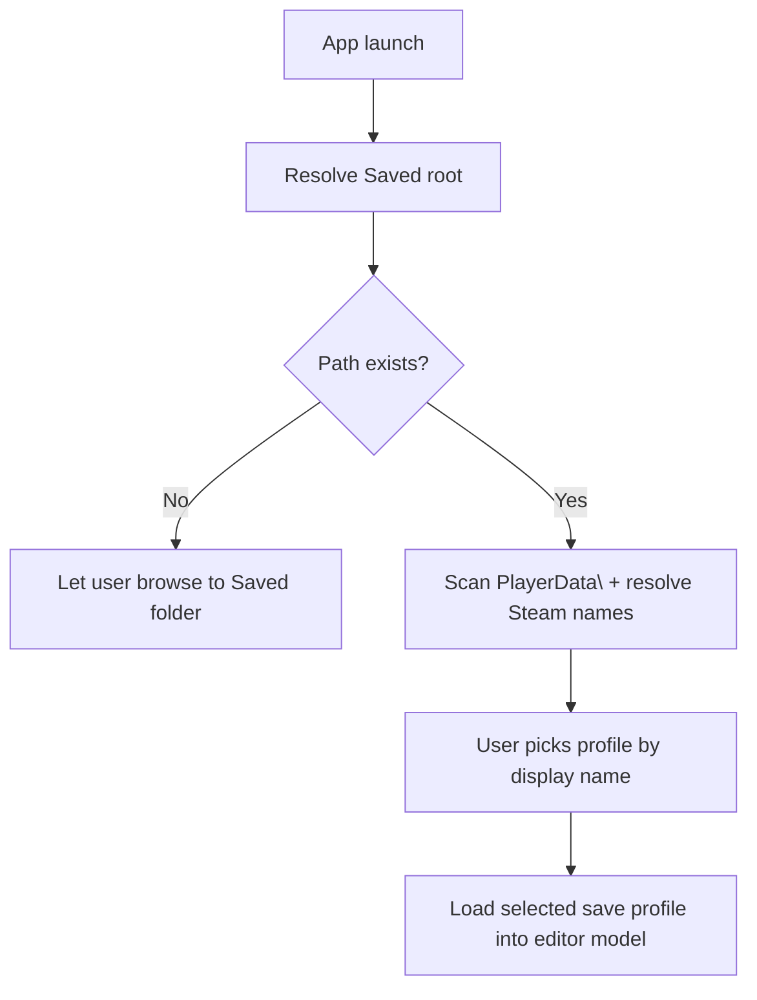
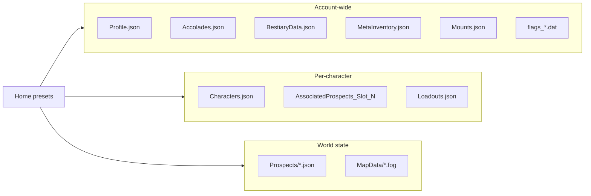
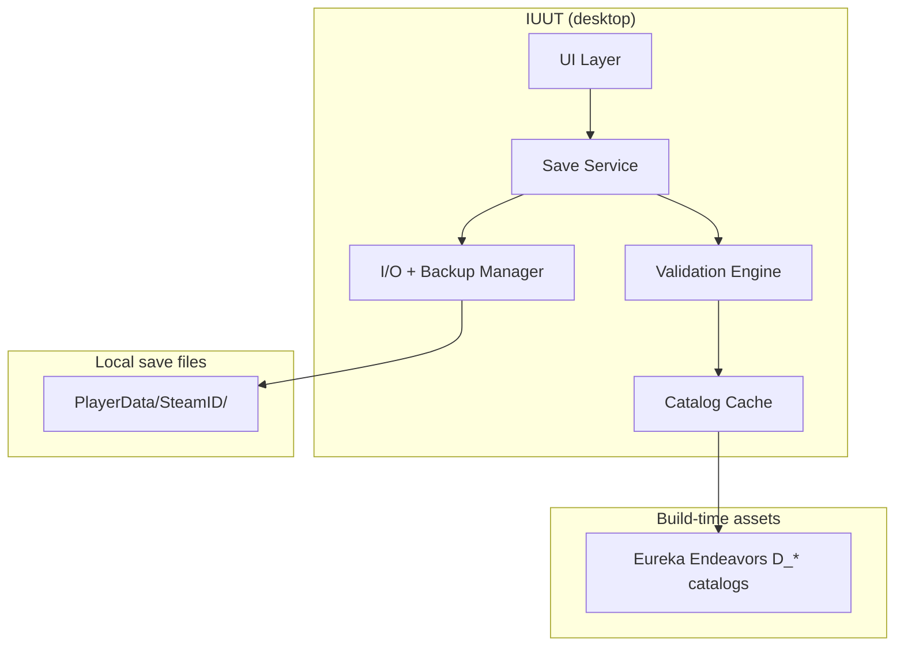

# Icarus Ultimate Utility Tool (IUUT) — Project Gameplan

> **Superseded for day-to-day reference by:** [IUUT-PROJECT-DOCUMENTATION.md](file:///C:/Users/josep/Projects/IcarusUltimateUtilityTool/docs/IUUT-PROJECT-DOCUMENTATION.md)
>
> This gameplan remains as a planning artifact. The master doc is the single source of truth.

---

## 0. Application concept (v2 — user-facing design)

This section captures the product vision and **locked decisions** (answered 2026-05-25).

### 0.1 Deliverable shape

| Requirement | Detail |
| --- | --- |
| **Format** | Standalone Windows desktop executable — double-click to run |
| **Stack** | **.NET 8 + WPF** (single-file publish → `IUUT.exe`) |
| **Platform** | **Windows only** — matches Icarus; no macOS/Linux target |
| **Priority** | User-friendliness over everything else |

The app is **not** a CLI script, PowerShell tool, or "edit JSON by hand" workflow. Every editable field gets a proper control (checkbox, slider, numeric input, radio group, dropdown, searchable list).

### 0.2 Path discovery on launch

On first open, the app resolves paths automatically:

```text
%LOCALAPPDATA%\Icarus\Saved\
  └── expands to C:\Users\<WindowsUsername>\AppData\Local\Icarus\Saved\
```

**Never hardcode `josep`** — always use `%LOCALAPPDATA%` / `Environment.GetFolderPath(SpecialFolder.LocalApplicationData)`.



Two logical zones under `Saved\`:

| Zone | Path | Editor scope |
| --- | --- | --- |
| **Engine / client config** | `Saved\Config\WindowsNoEditor\*.ini` | **Out of scope v1** — future: fog disable, engine tweaks (see §0.9) |
| **Player saves (meat & potatoes)** | `Saved\PlayerData\<SteamID>\` | **Primary editor target** |

Observed INI files in config (graphics, input, engine): `Engine.ini`, `GameUserSettings.ini`, `Input.ini`, plus many empty stub INIs. These affect client settings, not character progression.

### 0.3 Steam save profiles (display names)

`PlayerData\` contains **one subfolder per Steam account** that has played Icarus on this PC. On disk each folder is named by **SteamID64**; in IUUT all user-facing UI shows the resolved **Steam persona name** instead.

```text
PlayerData\                          ← IUUT UI shows PersonaName, not folder name
├── 00000000000000000\    ← on disk: SteamID64 (example → UI: "Joseph")
├── 00000000000000001\    ← on disk: second account (→ UI: resolved name)
└── ...
```

Inside each SteamID64 folder lives the full save set (`Profile.json`, `Characters.json`, `Prospects\`, etc.). The `Profile.json` → `UserID` field **must match** the folder name. **IUUT never renames folders.**

**UI behaviour (locked — see master doc §7.5.1):**

1. Dropdown lists every save profile by **resolved PersonaName** (primary label)
2. Secondary line per entry: SteamID64 · character count · last modified
3. Resolution order: IUUT cache → local Steam `loginusers.vdf` (offline) → Steam Web API (online) → fallback to SteamID64
4. Settings: optional Steam Web API key, cache TTL, manual `Saved\` root override
5. Future: auto-select profile matching currently logged-in Steam user (`MostRecent` in vdf)

**Terminology in docs/UI:**

| Term | Meaning |
| --- | --- |
| **Save profile** | The Steam account whose saves you are editing — shown as **PersonaName** in UI |
| **`Profile.json`** | Game file (currencies, workshop) — not the same as "save profile" |
| **SteamID64 folder** | On-disk path under `PlayerData\` — never renamed |

### 0.4 When edits persist (locked)

**Empirically verified:** editing while on the game's **root Main Menu** works (100% success in owner testing). The game does not need to be fully closed.

**Safest option:** game **100% closed**.

**Also safe (tested):** game open on **Main Menu only** (before Character Selection).

**Untested / at user's risk:** Character Selection, Orbital Workshop, any in-game menu. The app warns but does not block — user accepts responsibility for menu state.

| Game state | Editor behaviour |
| --- | --- |
| **Game not running** | ✅ Recommended — show green "Safest" status |
| **Main Menu** (root title menu) | ✅ Tested OK — show amber "OK if on Main Menu" |
| **Character Selection / Workshop / other menus** | ⚠️ Warn: untested — edits may not persist |
| **Inside a prospect (in-world)** | 🛑 Strong warn — likely won't stick or may corrupt |

**UI copy (persistent banner when `Icarus-Win64-Shipping.exe` detected):**

> Recommended: fully close Icarus before saving. If the game is open, stay on the **Main Menu** only. Workshop and other screens are untested — you accept the risk.

Detect process via `Icarus-Win64-Shipping.exe`. Never hard-block saves based on game state — warn only.

### 0.5 Home screen — three entry presets

The **first screen after save profile selection** is preset-driven, not a wall of tabs:

```
┌──────────────────────────────────────────────────────────────────┐
│  Icarus Ultimate Utility Tool (IUUT)                 [⚙ Settings]│
├──────────────────────────────────────────────────────────────────┤
│  Save root:  C:\Users\...\AppData\Local\Icarus\Saved      [Browse]│
│  Profile:    Joseph                                    [▼]         │
│              00000000000000000 · 3 characters                    │
│  Status:     ● 12/12 JSON files OK   ⚠ Return to Main Menu       │
│  Steam:      ☁ Names resolved  — or —  📴 Offline (cached names) │
├──────────────────────────────────────────────────────────────────┤
│                                                                  │
│   ┌─────────────────┐  ┌─────────────────┐  ┌─────────────────┐│
│   │  🚑 BROKEN SAVE │  │  ⚡ LAZY MAX    │  │  🎛 CUSTOM      ││
│   │    RECOVERY     │  │  (absolute max) │  │  (fine-tune)    ││
│   │                 │  │                 │  │                 ││
│   │ Scan & repair   │  │ One-click max   │  │ Full editor UI  ││
│   │ with templates  │  │ everything      │  │ all categories  ││
│   └─────────────────┘  └─────────────────┘  └─────────────────┘│
│                                                                  │
│  [💾 Backup Joseph's save]  [🔍 Health report]                     │
└──────────────────────────────────────────────────────────────────┘
```

#### Preset A — Broken Save Recovery

**Intent:** Persona with corrupted/truncated JSON, bad Steam Cloud merge, crash mid-write.

**Flow (locked — Q3: option a):**

1. Run health scan on every file in the selected save profile's SteamID64 folder
2. For each broken file:
   - Try parse current file
   - **Glob `<File>.*backup*`** to discover backup candidates regardless of naming convention (covers `.backup`, `.backup_<N>`, and `.<N>.backup` — the latter observed on `Loadouts.json.4.backup`; see Icarus-Analysis.md §10)
   - Rank candidates by `(parses cleanly, mtime desc)`; prospects with ≥2 clean candidates take the second-newest (freshest may be the corrupted in-memory flush)
   - If a clean backup exists → restore it
   - If no backup parses → **known-template repair**: rebuild minimum valid JSON skeleton, merge any salvageable fields from corrupt bytes
3. Show recovery report with per-file status
4. If any file required template repair (not full backup restore), show prominent flag:

   > **Only partial recovery possible.** Recommend further restoration via the **Custom** tab.

5. Master backup of entire folder before any repair

**"Known-template repair"** = valid empty/minimal structure + merge salvageable data — **not** inventing gameplay progress from nothing.

#### Preset B — Lazy Max

**Intent:** One-click max of core account progression — **intelligent, non-breaking**. Does not touch world blobs, loadouts, or prospect state unless necessary.

**Lazy Max always applies (locked — Q5 core trio):**

| Target | Action |
| --- | --- |
| `Characters.json` (all slots) | Max all player talents @ rank 4 (skip `*_Reroute*`), XP ≥ 80M, `XP_Debt = 0`, revive dead/abandoned |
| `Profile.json` | Max all known `MetaResources`; unlock all `Workshop_*` + `Prospect_*` talents @ rank 1 |
| `Accolades.json` | Append every `D_Accolades` row not already present |
| `BestiaryData.json` | Max `NumPoints` per group (add missing groups from catalog) |

**Lazy Max explicitly does NOT auto-apply:**

| Target | Reason |
| --- | --- |
| `MetaInventory.json` stash fill | User choice — use Custom → Orbital Stash UI |
| `Prospects\*.json` blobs | FProperty binary — risk of breaking worlds |
| `Loadouts`, `AssociatedProspects` | GUID / world coupling — leave unless unstick needed |
| `Mounts.json`, `flags_*.dat` | Secondary progression — Custom tab only |
| `Config\*.ini` | Out of scope v1 |

**Lazy Max confirmation dialog** lists the four files above + character count. Auto-backup before apply. Game **rewrites each over-ranked talent to that row's true max** on load — empirically ~71% of player talents end up at Rank 1, ~9/10/10% at 2/3/4. The Lazy Max preset relies on this clamp to stay non-destructive.

**Optional post-Lazy Max nudge:** "Open Custom → Orbital Stash to add meta gear?" — links to stash editor, does not auto-fill.

#### Preset C — Custom (fine-tune)

**Intent:** Full categorized editor. User picks exactly what to change.

**Proposed sidebar categories** (each opens controls, not raw JSON):

| Category | Controls | Source file(s) |
| --- | --- | --- |
| **Account & Currencies** | Sliders/spinners per MetaResource; refund/credits/exotics/biomass | `Profile.json` |
| **Workshop Blueprints** | Searchable checklist of all workshop unlocks | `Profile.json` → `Talents` |
| **Account Flags** | Numeric flag list with add/remove | `Profile.json` → `UnlockedFlags` |
| **Characters** | Per-slot tabs: **name editable**; XP slider, debt, dead/abandoned toggles | `Characters.json` |
| **Talents** | Tree browser with rank sliders 0–4 per talent; bulk "max tree" buttons | `Characters.json` |
| **Cosmetics** | **Read-only display** — editable in-game natively | `Characters.json` → `Cosmetic` |
| **Accolades** | Checklist of all accolades; filter completed/missing | `Accolades.json` |
| **Bestiary** | Slider per creature group for scan points | `BestiaryData.json` |
| **Orbital Stash** | **Visual stash grid** — render items from `MetaInventory.json` with catalog display names; per-item durability/health bar; **Repair** (set durability to max), **Replace** (swap RowName), **Add** (pick from catalog), **Remove**; respect loadout GUID references | `MetaInventory.json` |
| **Loadouts** | Per-prospect loadout viewer; envirosuit + meta items | `Loadout\Loadouts.json` |
| **Prospects (index)** | List associations; delete to unstick; state/difficulty radios | `AssociatedProspects_Slot_*.json` |
| **Prospects (worlds)** | Per-file header editor; blob status (hash OK / corrupt) | `Prospects\*.json` |
| **Mounts** | List mounts; name, level, type; talent checklist | `Mounts.json` |
| **Engine Flags** | Flag ID checklist | `flags_<SteamID>.dat` |
| **Advanced / Raw** | Read-only JSON viewer + export; edit mode for power users | Any |

Every category has **Preview Changes → Apply** with diff summary.

### 0.6 Expanded core save coverage

Beyond the original P0–P2 split, the product goal is **all JSON + selected binary files editable through UI controls**:



| File | UI depth target | Lazy Max | Recovery |
| --- | --- | --- | --- |
| `Profile.json` | Full | ✅ | ✅ template + backup restore |
| `Characters.json` | Full | ✅ | ✅ nested wrapper repair |
| `Accolades.json` | Full | ✅ | ✅ append-only repair |
| `BestiaryData.json` | Full | ✅ | ✅ |
| `MetaInventory.json` | Full stash UI (§0.5) | ❌ Custom only | ✅ GUID-aware restore |
| `Loadouts.json` | Full | ❌ | ✅ restore with MetaInventory |
| `AssociatedProspects_Slot_*.json` | Full | ❌ | ✅ |
| `Prospects\*.json` | Header full; blob verify/repair | ❌ | ✅ backup restore + hash fix |
| `Mounts.json` | JSON fields + talents | ❌ Custom only | ✅ |
| `flags_*.dat` | Flag checklist | ❌ Custom only | ✅ |
| `MapData\*.fog` | View/delete reset only | ❌ | ❌ |
| `Config\*.ini` | **Future** (§0.9) | ❌ | ❌ |

### 0.7 Packaging & distribution (locked)

| Item | Decision |
| --- | --- |
| **Runtime** | .NET 8 |
| **UI framework** | WPF (native Windows controls, data binding, tree views for talents) |
| **Ship as** | Single-file `IUUT.exe` + optional portable zip |
| **Size target** | ~15–25 MB self-contained |
| **Prerequisites** | None exposed to user — .NET bundled via self-contained publish |

Core library (`IcarusSave.Core`) holds all parse/mutate/validate logic; WPF project is thin UI shell.

### 0.8 Decisions log (locked 2026-05-25)

| # | Decision |
| --- | --- |
| **Q1** | **.NET 8 + WPF**, Windows-only single-file exe |
| **Q2** | Safest = game closed. Main Menu = tested OK. Workshop/other menus = warn, user accepts risk. Never hard-block. |
| **Q3** | Template repair (option a) + **"Only partial recovery possible — use Custom tab"** flag |
| **Q4** | Config INIs **out of scope v1**; future engine-mod tab (fog disable, etc.) — see §0.9 |
| **Q5** | Lazy Max = Characters + Profile + Accolades + Bestiary only. Stash = Custom UI with visual grid, repair/swap. No blob/loadout auto-mutation. |
| **Q6** | **Windows only** — no Linux/macOS compatibility work |
| **Q7** | Cosmetics read-only in editor. **Character name** editable only. |
| **Q8** | Steam Cloud = **optional recommendation** in settings/help — not enforced |
| **Q9** | Working title **Icarus Ultimate Utility Tool (IUUT)** |

### 0.9 Future scope — Engine config (`Config\WindowsNoEditor\`)

Not v1. Documented for later once INI key acceptance is understood:

- **Motivation:** QoL engine tweaks — e.g. disabling swamp fog (`Engine.ini` / render cvars)
- **Blocker:** Need to learn which declarations the UE4 client parses and accepts without rejection
- **UI concept (future):** "Engine Mods" tab with toggles like "Reduce/disable zone fog", backed by known-safe INI snippets
- **Risk:** Wrong INI edits can prevent launch — separate backup + validate-before-write flow

---

## 1. What we already know

Prior work ([max-icarus-characters plan](max-icarus-characters_47df3b52.plan.md)) successfully modified `Characters.json` in-place:

- Unified all talents across 3 characters to max observed ranks + 16 Mendel Genetics talents at Rank 4
- Set `XP_Debt = 0`, bumped `XP` to ≥ 80,000,000
- Game accepted the edit on next load and **rewrote each talent to that row's specific true max**. Empirical post-load distribution on the live save: **~71 % rank 1 / ~9 % rank 2 / ~10 % rank 3 / ~10 % rank 4** — i.e. the majority of player talents are 1-rank binary unlocks. *(Single observation — re-verify on each `DataVersion` bump.)*
- (* The wireframe count `1067` is this account's per-save union, not the full `D_Talents` player-tree total; treat it as illustrative.)

A full field guide lives at `%LOCALAPPDATA%\Icarus\Saved\Icarus-Analysis.md` (720 lines, empirically verified on a live Mendel save). **Treat that document as the technical spec**; this gameplan turns it into a shippable product roadmap.

### Save location

```text
%LOCALAPPDATA%\Icarus\Saved\PlayerData\<SteamID>\
```

The tool auto-detects all `<SteamID>` folders under `PlayerData\` (multi-account support on one PC).

### File inventory (editor relevance)

| Priority | File | Format | Why it matters |
| --- | --- | --- | --- |
| P0 | `Profile.json` | JSON | Account currencies, workshop blueprint unlocks, account flags |
| P0 | `Characters.json` | Nested JSON (stringified inner blobs) | Character roster, talents, XP, death/abandon state |
| P0 | `Accolades.json` | JSON | Achievement log |
| P1 | `MetaInventory.json` | JSON | Orbital workshop stash |
| P1 | `BestiaryData.json` | JSON | Bestiary scan progress |
| P1 | `AssociatedProspects_Slot_N.json` | Nested JSON | Per-character prospect index (unstick softlocks) |
| P1 | `Loadout\Loadouts.json` | JSON | Drop-in loadouts (GUID-linked to stash) |
| P2 | `Prospects\*.json` | JSON header + zlib/base64 blob | World saves (header edits safe; blob edits hard) |
| P2 | `Mounts.json` | JSON + UE FProperty bytes | Tamed mounts |
| P3 | `flags_<SteamID>.dat` | Binary | Engine unlock flags (separate namespace from Profile) |
| — | `MapData\*.fog`, `Mounts\*.exr` | Binary | Out of scope v1 |

### Critical editing rules

1. **Safest: game fully closed.** **Also OK (tested):** game on root **Main Menu**. Other menus = user accepts risk — app warns only. See §0.4.
2. **Timestamped backup before every write** — do not rely solely on the game's rolling `.backup` / `.backup_1` … `.backup_10` chain.
3. **Round-trip parse before save** — if JSON parse fails after serialization, abort and restore backup.
4. **UTF-8 without BOM** — match what the game writes.
5. **Prospect blob integrity** — any change to `ProspectBlob.BinaryBlob` requires recomputing SHA-1 hash of uncompressed bytes.
6. **Additive edits preferred** — the game clamps invalid ranks/counts on load; Lazy Max must not touch blobs/loadouts.
7. **Steam Cloud (recommendation only)** — optional help text: consider verifying cloud sync direction after edit. Not enforced.

---

## 2. User personas & jobs-to-be-done

### Persona A — "My save is broken"

- Game won't load after crash / power loss / bad Steam Cloud merge
- Character missing, stuck "in another prospect", or talents/XP reset
- **Needs:** one-click backup restore wizard, file health check, selective restore from `.backup_N`

### Persona B — "Fix one thing"

- Revive a dead character (`IsDead: false`)
- Clear XP debt, bump level cap XP
- Add missing Genetics talents after Mendel update broke a pre-patch character
- Unstick character from phantom prospect entry
- **Needs:** targeted editors with validation, preview diff before save

### Persona C — "Max everything" (lazy mode)

- Max talents on all characters
- Unlock all workshop blueprints in Profile
- Max currencies (Credits, Exotics, Biomass, Refund tokens)
- Grant all accolades / bestiary points
- Fill orbital stash with meta gear
- **Needs:** preset bundles ("Max Character", "Max Account", "Max Everything Safe") with clear warnings

### Persona D — Power user

- Edit prospect difficulty / insurance flags
- Rename mounts, bump mount level
- Raw JSON view for edge cases
- **Needs:** advanced tab, export/import individual files, plugin hooks later

---

## 3. Product principles

| Principle | Implementation |
| --- | --- |
| **Safety first** | Never write without backup; show diff; require explicit confirm |
| **Fail closed** | If validation fails, don't save; offer restore-from-backup |
| **Offline only** | No telemetry, no cloud upload, no account auth |
| **Catalog-driven UI** | Human-readable talent/item/accolade names from cached `D_*` tables |
| **Forward compatible** | Unknown `RowName` / `MetaRow` values round-trip verbatim |
| **Honest scope** | Prospect world blob editing = "advanced / experimental" until FProperty parser exists |

---

## 4. Recommended architecture



### Tech stack recommendation

| Layer | Choice | Rationale |
| --- | --- | --- |
| Runtime | **.NET 8 + WPF** | Windows-only; native UI; BCL zlib/SHA-1; maps from PowerShell POC |
| Core logic | `IcarusSave.Core` class library (C#) — zero UI deps | Presets, parsers, validation shared by WPF shell |
| JSON | `System.Text.Json` with extension data for unknown fields | Nested stringified blobs in Characters.json |
| Compression | BCL `ZLibStream` (handles full zlib wrapper: header + deflate + Adler-32 trailer) | Prospect blob pipeline — see Icarus-Analysis.md §8.1 *Recompression* |
| Catalogs | JSON bundled at build; optional refresh from Eureka Endeavors | Offline-first |
| Packaging | **Self-contained single-file** `IUUT.exe` | ~15–25 MB; portable zip fallback |

**Architecture:** WPF shell → `IcarusSave.Core` → save files on disk. Presets (`Recovery`, `LazyMax`, `Custom`) call the same mutation engine.

### Core modules

```
IcarusUltimateUtilityTool/
├── IUUT.Core/           # Parse, mutate, serialize — zero UI deps
│   ├── Models/
│   ├── Parsers/
│   ├── Serializers/
│   ├── Services/
│   │   └── SteamProfileResolverService.cs
│   ├── ProspectBlob/
│   ├── Presets/
│   └── Validation/
├── IUUT.Catalog/
├── IUUT.Cli/
└── IUUT.App/            # WPF UI (Home presets + Custom categories)
```

---

## 5. Feature phases

### Phase 0 — Foundation (1–2 weeks)

**Goal:** Shared library that reads/writes the three highest-value JSON files safely.

- [ ] Auto-detect `%LOCALAPPDATA%\Icarus\Saved\`, resolve PersonaNames, list save profiles
- [ ] `SteamProfileResolverService` (cache → loginusers.vdf → Steam Web API)
- [ ] Main-menu safety banner when game process detected (see §0.4)
- [ ] Timestamped backup manager (IUUT-standard naming `<File>.iuut-backup-<YYYYMMDD-HHMMSS>`)
- [ ] Parsers: `Profile.json`, `Characters.json` (nested), `Accolades.json`
- [ ] Serializers with round-trip tests against user's real save (anonymized fixtures)
- [ ] Health check: "can parse all JSON files?" + list broken files
- [ ] CLI: `icarus-save check`, `icarus-save backup-all`

**Exit criteria:** Unit tests pass on anonymized fixtures cloned from live save structure.

### Phase 1 — Recovery wizard (1 week)

**Goal:** Persona A can recover without reading JSON.

- [ ] Glob `<File>.*backup*` to discover all backup candidates (covers `.backup`, `.backup_<N>`, and `.<N>.backup` — Loadouts uses the latter); rank by parse success + mtime
- [ ] For prospects with ≥2 clean candidates: pick the second-newest (the freshest may be the corrupted mid-write flush)
- [ ] **No-rotation files** (`MetaInventory.json`, `AssociatedProspects_Slot_*.json`): the game never produces backups for these. Fall back to IUUT's own `.iuut-backup-*` copies; if none exist, template repair or refuse. The pre-write `.iuut-backup-*` is the *only* safety net for these files.
- [ ] UI: "Restore Profile" / "Restore Characters" / "Restore All JSON" with file picker
- [ ] Master folder copy: zip entire `PlayerData\<SteamID>\` before bulk restore
- [ ] Post-restore checklist (return to Main Menu → apply → reload from menu)

**Restore order (document in UI):**

1. Profile.json
2. Characters.json
3. MetaInventory.json + Loadouts.json (together — shared GUIDs)
4. AssociatedProspects_Slot_*.json
5. Prospects\*.json (validate blob SHA-1 per file)
6. Accolades.json, BestiaryData.json, Mounts.json

### Phase 2 — Character editor (1–2 weeks)

**Goal:** Persona B + C can edit characters with a GUI.

Port proven logic from [icarus_max.ps1](file:///C:/Users/josep/AppData/Local/Temp/icarus_max.ps1):

- [ ] Character list (name, slot, XP, talent count, dead/abandoned badges)
- [ ] Per-character panels:
  - XP, XP_Debt (slider or numeric)
  - IsDead / IsAbandoned toggles
  - Talent tree browser (grouped by prefix: Hunting_, Resources_, Genetics_, …)
  - Search/filter talents by display name from catalog
- [ ] Presets:
  - **Clear XP debt**
  - **Max XP** (≥ 80M)
  - **Union max talents** (max rank per RowName across all characters on account)
  - **Add Mendel Genetics** (16 rows @ Rank 4)
  - **Max all talents** (every D_Talents player-tree row @ Rank 4, skip `*_Reroute*`)
- [ ] Cosmetic viewer (read-only v1; edit v2 with range validation)
- [ ] Diff view before save

**Validation:**

- Unique `RowName` per character
- `ChrSlot` unique, ≤ `Profile.NextChrSlot - 1`
- Skip reroute nodes: `Genetics_Mutation_Reroute`, `Genetics_Reroute2`, `Genetics_Reroute3`

### Phase 3 — Account editor (1 week)

**Goal:** Profile-level edits for currencies and workshop.

- [ ] MetaResources editor (Credits, Refund, Exotic1, Exotic_Red, Exotic_Uranium, Biomass, Licence)
- [ ] Preset: set currencies to user-defined caps (with "game may clamp" note)
- [ ] Workshop unlock browser (Profile.Talents — `Workshop_*` and `Prospect_*` rows @ Rank 1)
- [ ] Preset: **Unlock all workshop blueprints** (enumerate from catalog)
- [ ] UnlockedFlags viewer (account-level ints — edit with warning, no name mapping yet)
- [ ] Preserve `UserID`, `NextChrSlot`, `DataVersion` (read-only display)

### Phase 4 — Accolades & bestiary (3–5 days)

**Goal:** Persona C achievement/bestiary maxing.

- [ ] Accolades.json: list completed, add missing from `D_Accolades`
  - Auto-generate `TimeCompleted` as `YYYY.MM.DD-HH.MM.SS` (current local time)
  - `ProspectID` can be empty string or last-known prospect GUID
- [ ] Preset: **Grant all accolades**
- [ ] BestiaryData.json: edit `NumPoints` per `BestiaryGroup.RowName`
- [ ] Preset: **Max bestiary points** (set to catalog max or arbitrary high value — verify clamp behaviour)

### Phase 5 — Orbital stash & loadouts (1–2 weeks)

**Goal:** Visual stash editor + loadout awareness (not Lazy Max auto-fill).

- [ ] **Orbital Stash grid UI** — render `MetaInventory.json` items like in-game workshop stash
  - Catalog display name + icon placeholder per `RowName`
  - Per-item **durability/health bar** from `ItemDynamicData.Durability`
  - **Repair** button → set durability to catalog max
  - **Replace** → swap `ItemStaticData.RowName` (preserve or regen GUID per rules)
  - **Add item** wizard from `D_ItemsStatic` catalog
  - **Remove** with warning if GUID referenced in `Loadouts.json`
- [ ] Stack size editor (`ItemableStack`)
- [ ] Loadouts.json viewer: EnviroSuit + MetaItems per prospect/character slot
- [ ] Optional preset bundles user can apply manually (e.g. "Meta starter kit") — **not** part of Lazy Max

### Phase 6 — Prospect & mount tools (2–3 weeks)

**Goal:** Softlock recovery + light mount edits.

- [ ] AssociatedProspects_Slot_N: list entries, delete entry to unstick character
- [ ] Prospect header editor: `ProspectState`, `Difficulty`, `Insurance`, `AssociatedMembers`
- [ ] ProspectBlob pipeline: decode → verify SHA-1 → re-encode (no mutation yet)
- [ ] Mounts.json: edit JSON-mirrored fields (`MountName`, `MountLevel`, `MountType`)
- [ ] flags_*.dat: hex viewer + add/remove flag IDs

**Deferred:** Full FProperty parser for in-world item/creature edits (Phase 8+).

### Phase 7 — Polish & release (ongoing)

- [ ] Auto-update catalog cache from Eureka Endeavors (optional network)
- [ ] Export/import single file or full save folder
- [ ] Dark mode, Steam path detection
- [ ] README + disclaimer + GitHub releases
- [ ] Discord/Reddit community feedback loop

---

## 6. Preset catalog

### 6.1 Home-screen presets (primary UX)

| Preset | Entry point | Description |
| --- | --- | --- |
| **Broken Save Recovery** | Home card | Health scan → backup restore chain → template repair for unparseable files |
| **Lazy Max** | Home card | Characters + Profile + Accolades + Bestiary (§0.5 Preset B) |
| **Custom** | Home card | Full categorized fine-tune editor (§0.5 Preset C) |

### 6.2 Sub-presets (inside Custom mode)

Ship these as buttons within categories or an "Quick actions" drawer:

| Preset ID | Name | Files touched | Risk |
| --- | --- | --- | --- |
| `recover-json` | Restore from best backup | Selected files | Low |
| `char-clear-debt` | Clear XP debt | Characters.json | Low |
| `char-max-xp` | Max level XP (80M+) | Characters.json | Low |
| `char-max-talents-union` | Max talents from union of account | Characters.json | Low — game clamps ranks |
| `char-max-talents-all` | All player talents @ 4 | Characters.json | Low — game clamps ranks |
| `char-revive` | Revive dead/abandoned | Characters.json | Medium — may affect prospect state |
| `account-max-currency` | Max MetaResources | Profile.json | Low — game may clamp |
| `account-unlock-workshop` | All Workshop_/Prospect_ blueprints | Profile.json | Low |
| `account-all-accolades` | All D_Accolades rows | Accolades.json | Low |
| `account-max-bestiary` | Max NumPoints all groups | BestiaryData.json | Low |
| `unstick-character` | Remove prospect association | AssociatedProspects + maybe Loadouts | Medium |
| `lazy-max` | Lazy Max (home) | Characters, Profile, Accolades, Bestiary | Low–medium — game clamps values |
| `max-everything-safe` | Custom quick action | Same as Lazy Max | Low–medium |

**Lazy Max** (home preset) = max talents/XP/debt/revive + max currencies/workshop + all accolades + max bestiary. Does **not** touch stash, loadouts, prospects, mounts, or blobs.

**Max Everything Safe** (Custom alias) = identical scope to Lazy Max for now.

---

## 7. Validation engine

Pre-save checks (block save if hard fail):

| Check | Applies to |
| --- | --- |
| JSON round-trip parse succeeds | All JSON files |
| `Profile.UserID` == folder name | Profile.json |
| Character count ≥ 1, unique `ChrSlot` | Characters.json |
| No duplicate talent `RowName` per character | Characters.json |
| New items have unique `DatabaseGUID` | MetaInventory.json |
| Loadout GUIDs exist in stash OR are in-flight (warn) | Loadouts.json |
| Prospect blob SHA-1 matches uncompressed bytes | Prospects\*.json |
| Game in-world | Strong warn only (§0.4) | Global |

Post-save checks (automatic):

- Re-read written file and re-run parse
- Log diff summary to session log

Soft warnings (allow save with confirm):

- Over-ranked talents (> catalog max)
- Currency above observed caps
- Editing `UnlockedFlags` without ID legend
- Removing prospect association while `ProspectState == Active`

---

## 8. Catalog maintenance

Bundle cached JSON at build time from [Eureka Endeavors](https://icarus.eurekaendeavors.com/catalog/):

| Table | Used for |
| --- | --- |
| `D_Talents` | Character talents, Profile workshop unlocks, mount talents |
| `D_ItemsStatic` | Stash/loadout items |
| `D_Accolades` | Accolade picker |
| `D_BestiaryData` | Bestiary groups |
| `D_MetaResources` | Currency row labels |

**Update script** (run before each release or when `Profile.DataVersion` changes):

```powershell
# Pseudocode — fetch HTML or API mirror, emit talents.json, items.json, ...
```

When Mendel shipped, 16 new `Genetics_*` rows appeared. The editor must not hardcode row lists in UI logic — always read from catalog with version stamp (`catalog-version: 2026-02-mendel`).

---

## 9. UI wireframes (conceptual)

See **§0.5** for the primary home screen (three preset cards). Custom mode wireframes below.

### Orbital Stash tab (Custom)

```
┌──────────────────────────────────────────────────────────────────┐
│  Orbital Stash (47 items)                    [+ Add Item]        │
├──────────────────────────────────────────────────────────────────┤
│  ┌─────────────┐  ┌─────────────┐  ┌─────────────┐              │
│  │ Envirosuit  │  │ Meta Pick   │  │ Meta Bow    │  ...         │
│  │ Tier 2      │  │ Shengong    │  │ Inaris D    │              │
│  │ ████████░░  │  │ ██████████  │  │ ███░░░░░░░  │              │
│  │ 4400/5500   │  │ [Repair]    │  │ [Repair][↔] │              │
│  └─────────────┘  └─────────────┘  └─────────────┘              │
│  Click item → detail pane: RowName, stack, durability, GUID      │
│  [Repair to Max] [Replace...] [Remove]                           │
└──────────────────────────────────────────────────────────────────┘
```

```
┌──────────────────────────────────────────────────────────────────┐
│  ← Back to Home          Custom Editor          [Preview] [Apply]│
├──────────────┬───────────────────────────────────────────────────┤
│ Account      │  Ren Credits    [========●===] 999,999            │
│ Characters   │  Red Exotics    [====●=======] 50,000             │
│ Talents      │  Biomass        [●=============] 999              │
│ Accolades    │  Refund Tokens  [==========●=] 99                 │
│ Bestiary     │  ...                                              │
│ Stash        │                                                   │
│ Loadouts     │  [ ] Unlock all workshop blueprints               │
│ Prospects    │  [ ] Unlock all prospect completion flags         │
│ Mounts       │                                                   │
│ Flags        │                                                   │
│ Advanced     │                                                   │
└──────────────┴───────────────────────────────────────────────────┘
```

### Character tab (within Custom)

```
┌──────────────────┬──────────────────────────────────────┐
│ IM PANICKING     │  XP: [57356316    ]  Debt: [0]     │
│ PANICK           │  [ ] Dead  [ ] Abandoned            │
│ Im Lost          │                                      │
│                  │  Talents (1067*) [Search...]        │
│                  │  ├─ Hunting (142)                   │
│                  │  ├─ Resources (98)                  │
│                  │  ├─ Genetics (16) ← Mendel          │
│                  │  └─ ...                             │
│                  │                                      │
│                  │  Presets: [Max Union] [Max All]     │
└──────────────────┴──────────────────────────────────────┘
│            [Preview Diff]  [Save Character File]        │
└─────────────────────────────────────────────────────────┘
```

---

## 10. Testing strategy

| Layer | Approach |
| --- | --- |
| Unit | Parse/serialize round-trip on anonymized fixtures per file type |
| Integration | Copy real save to temp dir → apply preset → verify parse → manual game load |
| Regression | Snapshot tests for Characters.json nested wrapper shape |
| Prospect blob | SHA-1 round-trip without mutation; mutate one byte → expect hash failure |
| Game acceptance | Manual checklist: launch Icarus, verify character screen, enter prospect |

**Fixture policy:** Never commit real Steam IDs or character names to public repo — scrub to `UserID: "00000000000000000"`, generic names.

---

## 11. Legal & community positioning

**Recommended README disclaimer:**

> This is an unofficial community tool for editing **local save files** you already own. It is not affiliated with RocketWerkz or anyone involved in publishing Icarus. Use at your own risk — always back up your save folder first. Multiplayer hosts should coordinate with their group before editing shared prospects.

**Positioning:**

- Frame as **save recovery and offline single-player convenience**, not cheat engine
- Open-source (MIT) to build community trust and allow catalog update PRs
- Encourage posting anonymized corrupt files as test fixtures (with permission)

**Steam Cloud note:** After local edit, Steam Cloud may overwrite with an older cloud copy on next launch. UI should warn: "Consider launching offline once after editing, or verify cloud sync direction in Steam."

---

## 12. Immediate next steps (ready to build)

1. **Scaffold solution** — `IcarusUltimateUtilityTool.sln`: `IUUT.Core`, `IUUT.Catalog`, `IUUT.App` (WPF), `IUUT.Tests`
2. **Core I/O** — auto-detect Saved root, resolve save profile display names, timestamped backups, UTF-8 no BOM writes
3. **Parsers** — `Profile.json`, nested `Characters.json`, `Accolades.json`, `BestiaryData.json`
4. **Port POC** — `LazyMaxService` from `icarus_max.ps1` (talents union + Genetics + XP/debt)
5. **Recovery** — health scan + backup chain + template repair + partial-recovery flag
6. **WPF Home** — three preset cards + save profile dropdown (PersonaName labels) + game-state warning banner
7. **WPF Custom v1** — Account, Characters (name + XP + talents), Accolades, Bestiary sidebars
8. **Catalog bundle** — scrape `D_Talents`, `D_Accolades`, `D_ItemsStatic`, `D_BestiaryData` into embedded resources
9. **Publish** — `dotnet publish -r win-x64 --self-contained true -p:PublishSingleFile=true`
10. **Manual acceptance** — Lazy Max on Main Menu → reload → verify (owner's proven workflow)

---

## 13. Success metrics

| Milestone | Definition of done |
| --- | --- |
| MVP | Edit Characters.json talents + XP with backup; game loads |
| v0.2 | Recovery wizard restores from `.backup_N` |
| v0.3 | `Profile.json` currencies + workshop unlocks |
| v0.4 | Accolades + bestiary presets |
| v1.0 | Stash editor + unstick character + public release |

---

## Appendix A — Characters.json mutation reference

Proven pipeline (from max-icarus-characters plan):

```mermaid
flowchart LR
    Read[Read Characters.json] --> Backup[Timestamped backup]
    Backup --> Parse[Outer JSON → inner strings → objects]
    Parse --> Map[Union talentMap: max Rank per RowName]
    Map --> Gen[Overlay 16 Genetics_* @ Rank 4]
    Gen --> Apply[Talents + XP_Debt=0 + XP≥80M per char]
    Apply --> Write[Re-stringify → UTF-8 no BOM]
    Write --> Verify[Re-parse and assert counts]
```



## Appendix B — Genetics talents (Mendel)

```
Genetics_GestationSpeed, Genetics_GestationBuff, Genetics_RecoverySpeed
Genetics_GenotypeMutation, Genetics_GenotypeMutation2
Genetics_PhenotypeMutation, Genetics_PhenotypeMutation2
Genetics_WildGenome, Genetics_WildPhenome, Genetics_WildBloodline
Genetics_SireBuff, Genetics_MaternalBuff
Genetics_Twins, Genetics_Lineage, Genetics_Experience, Genetics_Reduced_Threat
```

Skip: `Genetics_Mutation_Reroute`, `Genetics_Reroute2`, `Genetics_Reroute3` (visual path nodes, no rewards).

## Appendix C — Key file paths on this machine

| Resource | Path |
| --- | --- |
| Live save (on disk) | `%LOCALAPPDATA%\Icarus\Saved\PlayerData\00000000000000000\` |
| Live save (IUUT UI label) | **Joseph** — resolved via §7.5.1; SteamID64 shown as secondary line |
| Field guide | `%LOCALAPPDATA%\Icarus\Saved\Icarus-Analysis.md` |
| Master documentation | `Projects\IcarusUltimateUtilityTool\docs\IUUT-PROJECT-DOCUMENTATION.md` |
| Proof-of-concept script | `%LOCALAPPDATA%\Temp\icarus_max.ps1` |
| Validation script | `%LOCALAPPDATA%\Temp\icarus_validate.ps1` |

---

*Last updated: 2026-05-25 — IUUT naming, Steam PersonaName resolution in all UI references. See master doc §7.5.1.*
