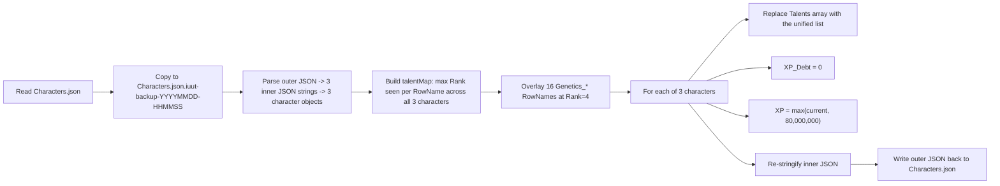

## Survey of the save

`[Characters.json](c:\Users\josep\AppData\Local\Icarus\Saved\PlayerData\00000000000000000\Characters.json)` is a two-level JSON: the outer object has one key, `"Characters.json"`, whose value is an array of three JSON-stringified character blobs. From the existing file:

- Slot 1 — `PANICK`, XP `65,491`, 23 talents, XP_Debt `0`
- Slot 2 — `IM PANICKING`, XP `57,356,316`, 1,051 talents, XP_Debt `0`
- Slot 3 — `Im Lost`, XP `61,212,334`, 930 talents, XP_Debt `0`

Across the three characters there are 1,051 unique `RowName` values and 2,004 `RowName`/`Rank` pairs total. The maximum rank observed for any given talent is the same across the two advanced characters, so the union of the two is the canonical "everything learned, every rank maxed" list.

The Mendel update (Week 220, Feb 2026) added the **Genetics** tree (RowName prefix `Genetics_`). Per the live Eureka Endeavors data catalog (`[D_Talents](https://icarus.eurekaendeavors.com/catalog/Talents/D_Talents/)`) and confirmed against the live save, the real Genetics RowNames are:

- `Genetics_GestationSpeed`, `Genetics_GestationBuff`, `Genetics_RecoverySpeed`
- `Genetics_GenotypeMutation`, `Genetics_GenotypeMutation2`
- `Genetics_PhenotypeMutation`, `Genetics_PhenotypeMutation2`
- `Genetics_WildGenome`, `Genetics_WildPhenome`, `Genetics_WildBloodline`
- `Genetics_SireBuff`, `Genetics_MaternalBuff`
- `Genetics_Twins`, `Genetics_Lineage`, `Genetics_Experience`, `Genetics_Reduced_Threat`

(The `Genetics_Mutation_Reroute`, `Genetics_Reroute2`, `Genetics_Reroute3` rows are visual path nodes with no Rewards/Icon and are intentionally skipped.)

## Mutation plan

## Implementation steps

1. **Switch to agent mode** (plan mode is read-only).
2. **Back up the file** with a timestamped copy next to the original (IUUT-standard naming `<File>.iuut-backup-<YYYYMMDD-HHMMSS>`):
   - `Copy-Item Characters.json Characters.json.iuut-backup-<ts>`
3. **Read and parse** via PowerShell:
   - `$outer = [System.IO.File]::ReadAllText($path) | ConvertFrom-Json`
   - `$chars = $outer.'Characters.json' | ForEach-Object { $_ | ConvertFrom-Json }`
4. **Build the unified Talents list**:
   - `$talentMap = @{}` then iterate every character's `Talents` and keep the max `Rank` seen per `RowName`.
   - Overlay the 16 Genetics RowNames listed above at `Rank = 4`.
   - Materialize as an array of `[pscustomobject]@{ RowName=...; Rank=... }`.
5. **For each character object**, set:
   - `$c.Talents = $unifiedTalents`
   - `$c.XP_Debt = 0`
   - `$c.XP = [Math]::Max([int64]$c.XP, 80000000)` (covers the level-60 cap and any future increases)
   - Leave `CharacterName`, `ChrSlot`, `IsDead`, `IsAbandoned`, `LastProspectId`, `Location`, `UnlockedFlags`, `MetaResources`, and the full `Cosmetic` block untouched.
6. **Re-serialize**:
   - `$newInner = $chars | ForEach-Object { $_ | ConvertTo-Json -Depth 20 }`
   - `$newOuter = [pscustomobject]@{ 'Characters.json' = @($newInner) } | ConvertTo-Json -Depth 20`
   - Note: PowerShell's `ConvertTo-Json` will switch the indent style from the game's tabs/CRLF to spaces/LF, but the game loader uses standard JSON parsing and accepts either; only the byte-for-byte formatting differs.
7. **Write back atomically** with `[System.IO.File]::WriteAllText($path, $newOuter, (New-Object System.Text.UTF8Encoding $false))`. Do **not** use `[System.Text.Encoding]::UTF8` — that encoder emits a BOM, contradicting the game's "UTF-8 without BOM" convention (see Icarus-Analysis.md §10 rule 4 and master doc §7.7).
8. **Validate** post-write: re-parse the file, confirm `Count == 3`, each character has `Talents.Count == 1067` (1051 existing + 16 Genetics), `XP_Debt == 0`, `XP >= 80,000,000`, and that `IM PANICKING`, `PANICK`, `Im Lost` are still present with their original `ChrSlot` values. **Note:** `1067` is this account's union — not the full `D_Talents` player-tree row count — so a different save (or a future patch that adds talents) may legitimately produce a different number; treat the value as a sanity check, not a strict invariant.

## Notes / things I'm intentionally NOT doing

- Not touching `Profile.json`, `MetaInventory.json`, or any prospect save — only the character roster.
- Not modifying cosmetics, gender, voice, scars, or the `UnlockedFlags` list.
- Not removing any talent that's already on a character (purely additive / max-out).
- Game must be closed before the script runs so it doesn't overwrite our edit on shutdown.
- If the game ever re-validates rank caps on load, talents whose true max is below 4 will be auto-clamped; nothing else breaks.